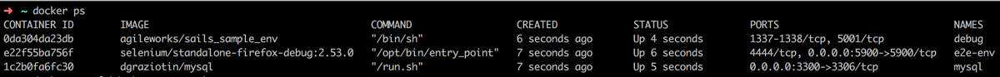
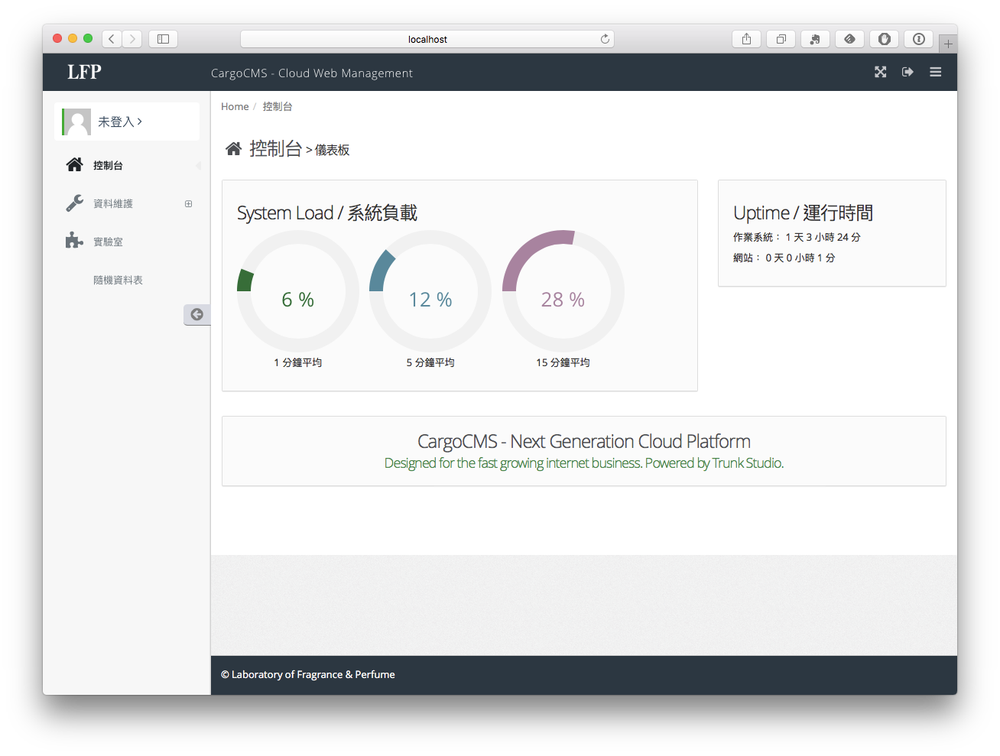

# 透過 Docker 運行飯粒專案


### debug service

```
debug:
  container_name: debug
  image: agileworks/sails_sample_env
  command: "/bin/sh"

  expose:
    - "1338"
  ports:
    - "5001:5001"

  volumes:
    - ./:/sailsSample
  working_dir: /sailsSample

  depends_on:
    - "e2e-env"

  networks:
    - front-tier
```

由上面的設定檔可以看到使用前面章節：[建置專案 Docker 環境](../build/README.md) 所建立的 image

`image: agileworks/sails_sample_env`

因為此專案所使用的 port 為 `5001`，需要可以被 host 存取，所以定義為

```
ports:
  - "5001:5001"
```

而若只是 container 之間的網路存取，則使用 expose


```
expose:
  - "1338"
```

此專案另外需要另外兩個 container 協同

```
depends_on:
  - "e2e-env"
```

其中 `e2e-env` 將在 [透過 Docker 運行專案並執行 e2e test](../docker-e2e/README.md) 使用。


## 運行 docker-compose

```
docker-compose run --rm \
--service-ports \
--name debug debug
```

## 運行中



## 在 docker 內啟動 server

`npm start`

存取 `http://localhost:5001/admin`


