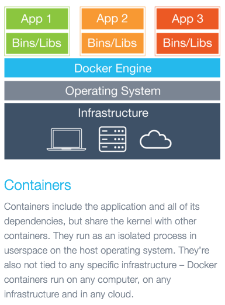

什麼是 Docker
=============

參考
----

-	[《Docker —— 從入門到實踐­》正體中文版](https://philipzheng.gitbooks.io/docker_practice/content/introduction/what.html)
-	[What is Docker?](https://www.docker.com/what-docker)

Docker 是一個開源專案，誕生於 2013 年初，最初是 dotCloud 公司內部的一個業餘專案。它基於 Google 公司推出的 Go 語言實作。 專案後來加入了 Linux 基金會，遵從了 Apache 2.0 協議，原始碼在 GitHub 上進行維護。

Docker 自開源後受到廣泛的關注和討論，以至於 dotCloud 公司後來都改名為 Docker Inc。Redhat 已經在其 RHEL6.5 中集中支援 Docker；Google 也在其 PaaS 產品中廣泛應用。

Docker 專案的目標是實作輕量級的作業系統虛擬化解決方案。 Docker 的基礎是 Linux 容器（LXC）等技術。

在 LXC 的基礎上 Docker 進行了進一步的封裝，讓使用者不需要去關心容器的管理，使得操作更為簡便。使用者操作 Docker 的容器就像操作一個快速輕量級的虛擬機一樣簡單。

下面的圖片比較了 Docker 和傳統虛擬化方式的不同之處，可見容器是在作業系統層面上實作虛擬化，直接使用本地主機的作業系統，而傳統方式則是在硬體層面實作。

