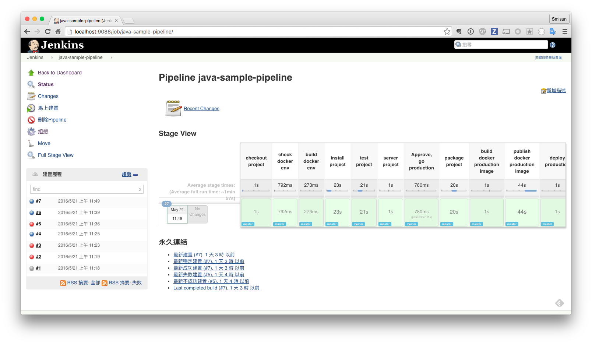

# 使用 Pipeline 透過 docker 進行建置

我們可以把前面章節所完成的相關 task 濃縮為單一個 Jenkinsfile

```
node {

  stage 'checkout project'
  git url: 'https://github.com/agileworks-tw/spring-boot-sample.git'

  stage 'check docker env'

  sh "docker -v"
  sh "docker-compose -v"
  sh "docker ps"

  stage 'build docker env'
  sh "make build-docker-env"

  stage 'test project'
  sh "docker-compose run --rm test"

  stage 'server project'
  sh "docker-compose up -d server"

  try{
    stage 'Approve, go production'
    def url = 'http://localhost:8000/'
    input message: "Does staging at $url look good? ", ok: "Deploy to production"
  }finally{
    sh "docker-compose stop server"
  }

  stage 'package project'
  sh "docker-compose run --rm package"

  stage 'build docker production image'
  sh "make build-docker-prod-image"

  stage 'publish docker production image'
  sh "docker push localhost:5000/java_sample_prod"

  stage 'deploy production'
  sh "make deploy-production-local"

}

```

執行結果如下


