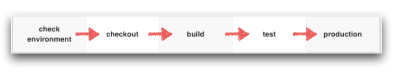

# 持續整合流程說明

持續整合(Continuous Integration)，也可以簡稱 CI，所要達到的目的就是專案建置流程的自動化。

相關自動化步驟如上圖順序，相關 Task 所要完成自動化作業的說明如下

## check environment

檢查 Docker 是否正確安裝，及相關的版號

## checkout

透過 `git` 取出範例專案。

## build

1. 建置專案所對應的 docker image，安裝所需套件
2. 透過專案所對應的 docker image 來建置專案

## test

1. 執行 Dojo 1：前端 E2E (End to End) Testing with Docker
2. 啟動 UAT Preview，令 QA 人員確認相關功能是否正常

## production

將專案建置為 production docker image
