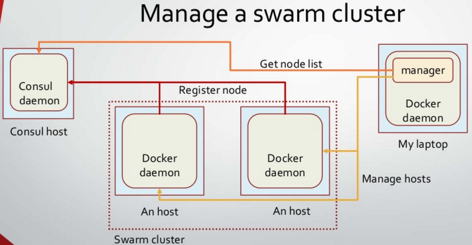

Docker-swarm 控制多網路區域的 docker
====================================

參考資料
--------

-	[get started: Docker overlay network](https://docs.docker.com/engine/userguide/networking/get-started-overlay/)

-	[Docker multi host networking](http://blog.docker.com/2015/11/docker-multi-host-networking-ga/)

-	[Docker swarm with Consul](http://www.slideshare.net/JulienMaitrehenry/swarm-49613398)

consul 搭配 docker 之架構
-------------------------



如上圖所示，我們需要建置：

```
1. Consul Key Store daemon
2. Docker Swarm master
3. Docker Swarm node
```

過程中透過 docker-machine 來建立相關的 docker engine，並且透過 Swarm master 來分派每個 docker container 要執行的節點。

設置 Consul key-value store
---------------------------

第一步驟，我們需要建立 Consul Key Store daemon，透過下列指令。

`docker-machine create -d virtualbox mh-keystore`

接著，我們可以透過

`eval "$(docker-machine env mh-keystore)"`

讓 docker-machine 把 docker engine 控制權切換到 mh-keystore。

mh-keystore docker-machine 將會提供相關資訊給 cluster node 之 docker engine 以便後續控制，下面是讀取設定得語法：

`docker-machine config mh-keystore`

將會輸出下面資料

```
--tlsverify
--tlscacert="/Users/spooky/.docker/machine/certs/ca.pem" --tlscert="/Users/spooky/.docker/machine/certs/cert.pem" --tlskey="/Users/spooky/.docker/machine/certs/key.pem"
-H=tcp://192.168.99.103:2376%
```

透過上面的內容，我們需要建立 consul 並且啟動

```
docker $(docker-machine config mh-keystore) run -d \
    -p "8500:8500" \
    -h "consul" \
    progrium/consul -server -bootstrap
```

建立 cluster node 之 docker engine
----------------------------------

為了展示，我們需要建立兩個節點，分別如下：

### swarm-master

```
docker-machine create \
-d virtualbox \
--swarm --swarm-image="swarm" --swarm-master \
--swarm-discovery="consul://$(docker-machine ip mh-keystore):8500" \
--engine-opt="cluster-store=consul://$(docker-machine ip mh-keystore):8500" \
--engine-opt="cluster-advertise=eth1:2376" \
mhs-demo0
```

### node

```
docker-machine create -d virtualbox \
--swarm --swarm-image="swarm:1.0.0" \
--swarm-discovery="consul://$(docker-machine ip mh-keystore):8500" \
--engine-opt="cluster-store=consul://$(docker-machine ip mh-keystore):8500" \
--engine-opt="cluster-advertise=eth1:2376" \
mhs-demo1
```

建立完成後，再透過 `docker-machine ls` 查看一下目前有的 machine 有哪些，顯示如下：

```
NAME          ACTIVE   DRIVER       STATE     URL                         SWARM
mh-keystore   -        virtualbox   Running   tcp://192.168.99.103:2376
mhs-demo0     *        virtualbox   Running   tcp://192.168.99.104:2376   mhs-demo0 (master)
mhs-demo1     -        virtualbox   Running   tcp://192.168.99.105:2376   mhs-demo0
```

切換到 swarm master 節點，並且加上 `--swarm` 參數:

`eval $(docker-machine env --swarm mhs-demo0)`

如此我們可以透過 swarm master 知道各節點的狀況，在執行 `docker info` 取的下面資訊：

```
Containers: 3
Images: 2
Role: primary
Strategy: spread
Filters: health, port, dependency, affinity, constraint
Nodes: 2
 mhs-demo0: 192.168.99.104:2376
  └ Containers: 2
  └ Reserved CPUs: 0 / 1
  └ Reserved Memory: 0 B / 1.021 GiB
  └ Labels: executiondriver=native-0.2, kernelversion=4.1.12-boot2docker, operatingsystem=Boot2Docker 1.9.0 (TCL 6.4); master : 16e4a2a - Tue Nov  3 19:49:22 UTC 2015, provider=virtualbox, storagedriver=aufs
 mhs-demo1: 192.168.99.105:2376
  └ Containers: 1
  └ Reserved CPUs: 0 / 1
  └ Reserved Memory: 0 B / 1.021 GiB
  └ Labels: executiondriver=native-0.2, kernelversion=4.1.12-boot2docker, operatingsystem=Boot2Docker 1.9.0 (TCL 6.4); master : 16e4a2a - Tue Nov  3 19:49:22 UTC 2015, provider=virtualbox, storagedriver=aufs
CPUs: 2
Total Memory: 2.043 GiB
Name: ca37a455e055
```

現在我們所在 docker-machine 是 swarm master，因此我們可以建立 overlay network，透過下面指令：

`docker network create --driver overlay my-net`

如此既使此 swarm 叢集下的節點不在同一個 host 也可以透過 overlay network 來進行 docker 間的溝通。

透過 `docker network ls` 來查詢目前 network 的配置，結果如下：

```

NETWORK ID          NAME                DRIVER
0c12ded9133d        my-net              overlay
398d539735a5        mhs-demo0/host      host
69c46465440e        mhs-demo0/bridge    bridge
60fb35d0f1b9        mhs-demo0/none      null
3d307d5ce727        mhs-demo1/bridge    bridge
063bc7f3af71        mhs-demo1/none      null
7439c6e27aa9        mhs-demo1/host      host
```

開始運行 docker
---------------

我們需要建立 client server 的架構來驗證運作狀況，首先我們需要 ...

### 建立 web server 使用 nginx

指令如下：

`docker run -itd --name=web --net=my-net --env="constraint:node==mhs-demo0" nginx`

該指令透過 `--env="constraint:node==mhs-demo0"` 來控制 docker 要建立的節點設為 `mhs-demo0`

透過 `--net=my-net` 來指定要建立在哪一個 network。

接著我們需要 ...

建立 client 對 web 進行 request
-------------------------------

指令如下：

`docker run -it --rm --net=my-net --env="constraint:node==mhs-demo1" busybox wget -O- http://web`

跟 web server 類似，透過 `--env="constraint:node==mhs-demo1"` 來控制 docker 要建立的節點為 `mhs-demo1`。

設置在同一個 network 以便兩者可以進行溝通，另外因為 server 已有命名為 `web` 我們可以透過 `http://web` 來進行 request。

執行結果如下

```
Connecting to web (10.0.0.2:80)
<!DOCTYPE html>
<html>
<head>
<title>Welcome to nginx!</title>
<style>
    body {
        width: 35em;
        margin: 0 auto;
        font-family: Tahoma, Verdana, Arial, sans-serif;
    }
</style>
</head>
<body>
<h1>Welcome to nginx!</h1>
<p>If you see this page, the nginx web server is successfully installed and
working. Further configuration is required.</p>

<p>For online documentation and support please refer to
<a href="http://nginx.org/">nginx.org</a>.<br/>
Commercial support is available at
<a href="http://nginx.com/">nginx.com</a>.</p>

<p><em>Thank you for using nginx.</em></p>
</body>
</html>
-                    100% |*******************************|   612   0:00:00 ETA
```

我們可以透過 `docker ps` 來查看一下目前 docker 的狀況

```
CONTAINER ID        IMAGE   COMMAND                  STATUS                   PORTS            NAMES
175be1c1bab0        busybox "wget -O- http://web"    Exited (0) 9 seconds ago                  mhs-demo1/busybox
ea02022ce6fb        nginx   "nginx -g 'daemon off"   Up 2 minutes             80/tcp, 443/tcp  mhs-demo0/web
```

可以看到從 NAMES 中可以清楚看到兩個 docker 分別跑在不同的 node 上，但彼此間溝通是沒有問題的。

使用 docker-compose 進行操作
----------------------------

設定檔如下

```
web:

  image: bfirsh/compose-mongodb-demo
  environment:
      - "MONGO_HOST=dockeradvancebook_mongo_1"
      - "constraint:node==mhs-demo0"
  ports:
      - "80:5000"
mongo:
  image: mongo
```

`docker-compose --x-networking --x-network-driver overlay up -d`

啟動完成後，再次透過 docker ps 來確認狀況，結果如下：

```

IMAGE                         COMMAND                PORTS                        NAMES
mongo                         "/entrypoint.sh mongo" 27017/tcp                    mhs-demo1/dockeradvancebook_mongo_1
bfirsh/compose-mongodb-demo   "/bin/sh -c 'python a" 192.168.99.104:80->5000/tcp  mhs-demo0/dockeradvancebook_web_1
```

如此就完成整個 demo，可以透過 `http://192.168.99.104` 存取執行結果。
