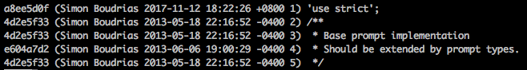

# git blame 指令


### 使用情境

* 追蹤 bug，查看這行程式誰的。

### 常用範例

| 範例                         | 說明     |
|----------------------------|--------|
| git blame -L 2,5 hello.txt |        |
| git blame -L 2 hello.txt   |        |
| git blame -L 2, hello.txt  |        |
| git blame -L ,5 hello.txt  | 追蹤修改紀錄 |

### 語法結構

```
usage: git blame [<options>] [<rev-opts>] [<rev>] [--] <file>

    <rev-opts> are documented in git-rev-list(1)

    --incremental         Show blame entries as we find them, incrementally
    -b                    Show blank SHA-1 for boundary commits (Default: off)
    --root                Do not treat root commits as boundaries (Default: off)
    --show-stats          Show work cost statistics
    --score-debug         Show output score for blame entries
    -f, --show-name       Show original filename (Default: auto)
    -n, --show-number     Show original linenumber (Default: off)
    -p, --porcelain       Show in a format designed for machine consumption
    --line-porcelain      Show porcelain format with per-line commit information
    -c                    Use the same output mode as git-annotate (Default: off)
    -t                    Show raw timestamp (Default: off)
    -l                    Show long commit SHA1 (Default: off)
    -s                    Suppress author name and timestamp (Default: off)
    -e, --show-email      Show author email instead of name (Default: off)
    -w                    Ignore whitespace differences
    --minimal             Spend extra cycles to find better match
    -S <file>             Use revisions from <file> instead of calling git-rev-list
    --contents <file>     Use <file>'s contents as the final image
    -C[<score>]           Find line copies within and across files
    -M[<score>]           Find line movements within and across files
    -L <n,m>              Process only line range n,m, counting from 1
    --abbrev[=<n>]        use <n> digits to display SHA-1s
```
