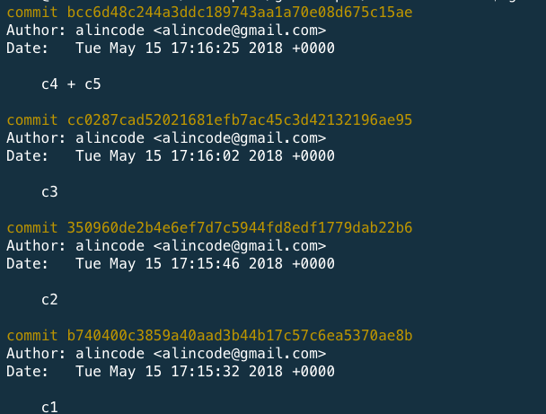

# log / show 指令




### 使用情境

* 查看送交內容 / 更變

### 常用指令範例

| 範例                                                                 | 說明                  |
|--------------------------------------------------------------------|---------------------|
| git show README.md                                                 |                     |
| git log [HEAD]                                                     | 查看 commit 歷史紀錄      |
| git log -2                                                         | 查看最後兩筆 commit 歷史紀錄  |
| git log master                                                     |                     |
| git log --oneline                                                  |                     |
| git log --author="alincode"                                        | 只查看特定人的送交紀錄         |
| git log -p hello.js                                                |                     |
| git log --follow README.md                                         | 列出包含該檔案變動的提交(包含改名前) |
| git log --oneline --abbrev-commit --all --graph --decorate --color |                     |
| git log --graph --oneline --all --decorate                         | 顯示所有分之並圖形化          |
| git log --since="1 weeks ago"                                      | 一週內的 log            |

* –graph：排列出 commit 節點的演進圖
* –oneline：最精簡的方式顯示．
* –all：顯示所有分支的commit紀錄。
* –decorate：表示要標示分支的名稱。

<!-- git log \^[commitA] # A 之後的提交(不列出 A 之前的提交，不含 A) -->
git log -[num] # 最近[num]筆的提交紀錄

### 語法結構

```
usage: git log [<options>] [<revision-range>] [[--] <path>...]
   or: git show [<options>] <object>...

    -q, --quiet           suppress diff output
    --source              show source
    --use-mailmap         Use mail map file
    --decorate[=...]      decorate options
    -L <n,m:file>         Process line range n,m in file, counting from 1
```