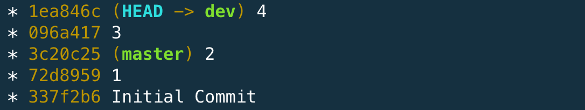
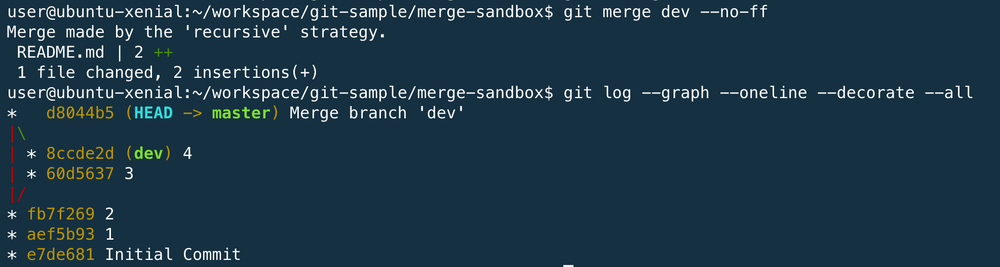

# git merge 指令

* 合併
* 修改內容的歷史記錄會維持原狀，但是合併後的歷史紀錄會變得更複雜。
* 預設會以 `fast-forward` 的模式進行。

### Fast-Forward Merge

當你目前的位置 (HEAD) 是某個要被 merge branch 上的 commit 的 root commit ，在沒有任何新的 commit 的情形下，要 merge 回來的時候，就會觸發 fast-forward 。

由於在原本的分支上沒有新的變更紀錄需要被 merged ，預設就會觸發 fast-forward merge ，就會直接把這個 commit HEAD 移動到要被 merge 的 commit 的位置，也不會新增一個 merge commit 。

#### merge 之前


#### merge 之後


### No Fast-Forward Merge

```
git merge dev —-no-ff
```



#### 使用情境

* 在開發一個功能時，通常都會開一支新的分支，使用 --no-ff 可以讓成員在日後可以很清楚辨識不同的功能，所包含的送交歷史紀錄有哪些。
* GitHub merge pull request 的策略，也是使用 --no-ff ，也是讓開發者可以方便辨別。

#### 缺點

* 即使一個很小的修改，也會拉出一條支線圖。


### 常用範例

| 範例               | 說明                    |
|------------------|-----------------------|
| git merge master | 合併 master 分支的資料，到目前分支 |
| git merge –abort | 放棄合併                  |

### 實際操作流程

```
git pull
git log --graph --oneline --decorate --all
git diff master
git merge master
```

### 語法結構

```
usage: git merge [<options>] [<commit>...]
   or: git merge [<options>] <msg> HEAD <commit>
   or: git merge --abort

    -n                    do not show a diffstat at the end of the merge
    --stat                show a diffstat at the end of the merge
    --summary             (synonym to --stat)
    --log[=<n>]           add (at most <n>) entries from shortlog to merge commit message
    --squash              create a single commit instead of doing a merge
    --commit              perform a commit if the merge succeeds (default)
    -e, --edit            edit message before committing
    --ff                  allow fast-forward (default)
    --ff-only             abort if fast-forward is not possible
    --rerere-autoupdate   update the index with reused conflict resolution if possible
    --verify-signatures   Verify that the named commit has a valid GPG signature
    -s, --strategy <strategy>
                          merge strategy to use
    -X, --strategy-option <option=value>
                          option for selected merge strategy
    -m, --message <message>
                          merge commit message (for a non-fast-forward merge)
    -v, --verbose         be more verbose
    -q, --quiet           be more quiet
    --abort               abort the current in-progress merge
    --progress            force progress reporting
    -S, --gpg-sign[=<key-id>]
                          GPG sign commit
    --overwrite-ignore    update ignored files (default)
```