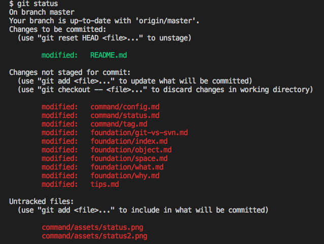

# git status 指令

### 使用情境

* 觀看檔案的狀態

### 狀態



* Untracked files：未被追蹤的檔案
* Changes not staged for commit：有被更動但尚未要提交的檔案
* Changes to be committed：將要提交的檔案
* staged


<!-- 這裡指的是 staged 跟 stash 是不同的歐，不要看錯了 -->

### 檔案分類

* 被追蹤
* 不被追蹤
* 被忽略

.gitignore

想忽略的檔案，如暫存檔、log、編譯後的檔案

```
# Logs
logs
*.log
npm-debug.log*
yarn-debug.log*
yarn-error.log*

# Runtime data
pids
*.pid
*.seed
*.pid.lock

# Directory for instrumented libs generated by jscoverage/JSCover
lib-cov

# Coverage directory used by tools like istanbul
coverage

# nyc test coverage
.nyc_output

# Grunt intermediate storage (http://gruntjs.com/creating-plugins#storing-task-files)
.grunt

# Bower dependency directory (https://bower.io/)
bower_components

# node-waf configuration
.lock-wscript

# Compiled binary addons (http://nodejs.org/api/addons.html)
build/Release

# Dependency directories
node_modules/
jspm_packages/

# Typescript v1 declaration files
typings/

# Optional npm cache directory
.npm

# Optional eslint cache
.eslintcache

# Optional REPL history
.node_repl_history

# Output of 'npm pack'
*.tgz

# Yarn Integrity file
.yarn-integrity

# dotenv environment variables file
.env
```

### 常用範例

| 範例         | 說明       |
|------------|----------|
| git status | 看目前檔案的狀態 |

### 語法結構

```
usage: git status [<options>] [--] <pathspec>...

    -v, --verbose         be verbose
    -s, --short           show status concisely
    -b, --branch          show branch information
    --porcelain           machine-readable output
    --long                show status in long format (default)
    -z, --null            terminate entries with NUL
    -u, --untracked-files[=<mode>]
                          show untracked files, optional modes: all, normal, no. (Default: all)
    --ignored             show ignored files
    --ignore-submodules[=<when>]
                          ignore changes to submodules, optional when: all, dirty, untracked. (Default: all)
    --column[=<style>]    list untracked files in columns
```