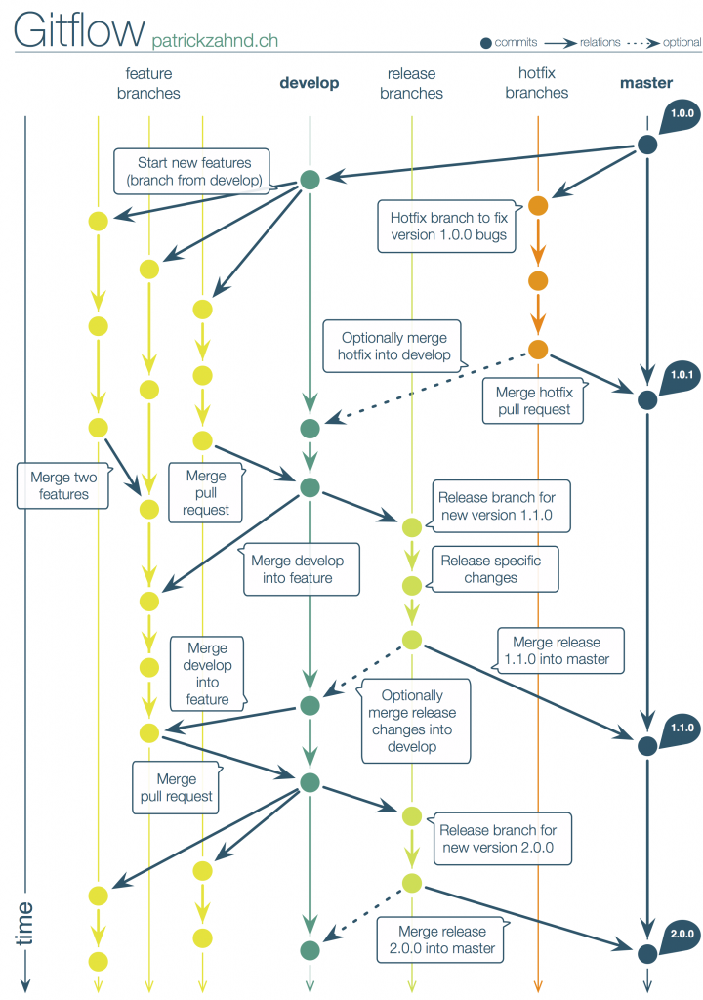

# Git Flow 整體概念

### 分支 branch

在開發軟體時，可能同時會有多人在開發同一功能或修復錯誤，也可能會有多個發佈版本的存在，並且需要針對每個版本進行維護。為了能支援同時進行數個功能的增加或版本控制，Git具備了分支的功能。分支是為了將修改記錄的整體流程分開儲存，讓分開的分支不受其他分支的影響，所以在同一個數據庫裡可以同時進行多個不同的修改。

#### 使用情境

* 可以讓你的系統依據不同的需求分別進行開發，又不互相影響。


#### 建議分之命名

```
git checkout -b hotfix/issue-1
git checkout -b feature/issue-1
```
### 主要 branch

* master: 主要版本，只接受 develop 和 Release 的 merge
* develop: 所有 Feature 開發都從這分支出去，完成後 merge 回來

### 支援 branch

* feature branches：從 develop 分支出來，當功能開發修改完成後 merge 回 develop
* release branches：從 develop 分支出來，是準備釋出的版本，只修改版本號與 bug，完成後 merge 回 develop 與 master，並在 master 標上版本號的 tag
* hotfix branches：從 master 分支出來，主要是處理已釋出版本需要立即修改的錯誤，完成後 merge 回 develop 與 master，並在 master 標上版本號的 tag

