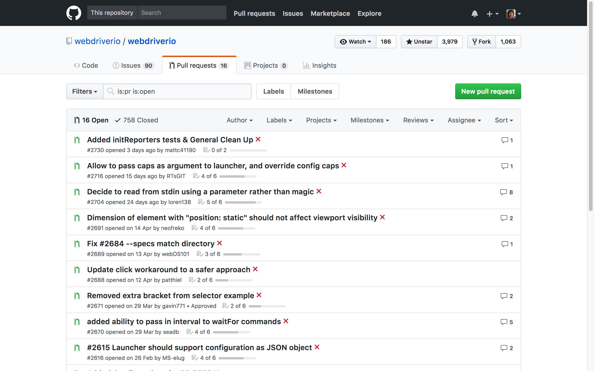
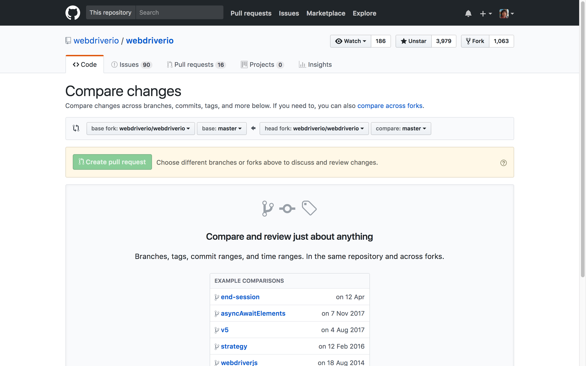
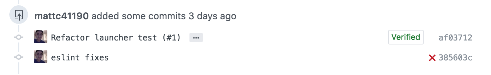

# Github Pull Request

Pull Request 是一種通知機制。你修改了他人的代碼，將你的修改通知原來的作者，希望他合併你的修改，這就是 Pull Request。

向 Github 託管的某一項目中的某一分支提出合併請求。項目管理者則可以在 github 的 web 界面上合併來自不同分支的代碼，解決合併衝突，做代碼審查或對代碼進行評論。

<!-- 
```
git pull-request -m "Implemented feature X" -b defunkt:master -h mislav:feature
``` 
-->

### 查看 PR



### 新增一個 PR







<!-- 
### 用 cli 發 PR

* brew install hub
* vi ~/.bash_profile

```
function pr() {
    base=$1;
    if [ "$1" == "" ]; then
        base="develop"
    fi
    hub pull-request -b team:"$base" -h team:`git rev-parse --abbrev-ref HEAD`;
}
``` -->