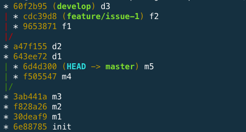

# rebase 練習題

<!-- 開一個新的 repo 不要共用 -->

### 1. 情境：重新指定送交的基礎位置

#### Step1

```
vi start.sh

echo "Hello World" >> README.md && git add . && git commit -m 'init'
echo "1" >> m1.md && git add . && git commit -m 'm1'
echo "2" >> m2.md && git add . && git commit -m 'm2'

git checkout -b develop
echo "1" >> d1.md && git add . && git commit -m 'd1'
echo "2" >> d2.md && git add . && git commit -m 'd2'

git checkout master
echo "3" >> m3.md && git add . && git commit -m 'm3'

sh start.sh
```


#### Step2

```
git checkout develop
git rebase master
```


#### Step3

```
git checkout master
git merge develop
```


### 2. 情境：合併 commit

#### Step1

```
vi start.sh

echo "Hello World" >> README.md && git add . && git commit -m 'init'
echo "1" >> m1.md && git add . && git commit -m 'm1'
echo "2" >> m2.md && git add . && git commit -m 'm2'
echo "3" >> m3.md && git add . && git commit -m 'm3'
echo "4" >> m4.md && git add . && git commit -m 'm4'
echo "5" >> m5.md && git add . && git commit -m 'm5'

sh start.sh
```



#### Step2

```
git rebase -i HEAD~3
// or
git rebase -i 124519e
```



#### Step3



#### Step4



#### Step5





### 3. 情境：指定要從哪裡開始

#### Step1

```
vi start.sh

echo "Hello World" >> README.md && git add . && git commit -m 'init'
echo "1" >> m1.md && git add . && git commit -m 'm1'
echo "2" >> m2.md && git add . && git commit -m 'm2'
echo "3" >> m3.md && git add . && git commit -m 'm3'
git checkout -b develop
echo "1" >> d1.md && git add . && git commit -m 'd1'
git checkout -b feature/issue-1
echo "1" >> f1.md && git add . && git commit -m 'f1'
echo "2" >> f2.md && git add . && git commit -m 'f2'
git checkout develop
echo "2" >> d2.md && git add . && git commit -m 'd2'
echo "3" >> d3.md && git add . && git commit -m 'd3'
echo "4" >> d4.md && git add . && git commit -m 'd4'

sh start.sh
```


#### Step2

```
git checkout feature/issue-1
git rebase --onto b93be68 8a42167
```


#### Step3

```
git rebase develop
```


### 4. 情境：兩個分支交疊在一起

* feature/issue-1 是從 develop 開出的分支
* develop 是從 master 開出的分支

#### Step1

```
vi start.sh

echo "Hello World" >> README.md && git add . && git commit -m 'init'
echo "1" >> m1.md && git add . && git commit -m 'm1'
echo "2" >> m2.md && git add . && git commit -m 'm2'
echo "3" >> m3.md && git add . && git commit -m 'm3'
git checkout -b develop
echo "1" >> d1.md && git add . && git commit -m 'd1'
echo "2" >> d2.md && git add . && git commit -m 'd2'
git checkout -b feature/issue-1
echo "1" >> f1.md && git add . && git commit -m 'f1'
echo "2" >> f2.md && git add . && git commit -m 'f2'
git checkout develop
echo "3" >> d3.md && git add . && git commit -m 'd3'
git checkout master
echo "4" >> m4.md && git add . && git commit -m 'm4'
echo "5" >> m5.md && git add . && git commit -m 'm5'

sh start.sh
```



#### Step2

```
git checkout develop
git rebase master
```


#### Step3

```
git checkout feature/issue-1
git rebase develop
```


### 5. 情境：悲劇現場

#### Step1

* init 有 1 個
* m 有 3 個
* d 有 4 個
* f 有 2 個

```
vi start.sh

echo "Hello World" >> README.md && git add . && git commit -m 'init'
echo "1" >> m1.md && git add . && git commit -m 'm1'
echo "2" >> m2.md && git add . && git commit -m 'm2'
echo "3" >> m3.md && git add . && git commit -m 'm3'
git checkout -b develop
echo "1" >> d1.md && git add . && git commit -m 'd1'
git checkout -b feature/issue-1
echo "1" >> f1.md && git add . && git commit -m 'f1'
echo "2" >> f2.md && git add . && git commit -m 'f2'
git checkout develop
echo "2" >> d2.md && git add . && git commit -m 'd2'
echo "3" >> d3.md && git add . && git commit -m 'd3'
echo "4" >> d4.md && git add . && git commit -m 'd4'

sh start.sh
```


#### Step2：參數位置弄顛倒了

```
git rebase --onto 6b193ca bac0cfe
```


### 6. rebase 衝突

```
echo "Hello World" >> README.md && git add . && git commit -m 'init'
echo "1" >> m1.md && git add . && git commit -m 'm1'
git branch hotfix/issue-1
vi m1.md

git add . && git commit -m 'hotfix update'
git checkout master

vi m1.md
git add . && git commit -m 'master update'
git checkout hotfix/issue-1
git rebase master
git diff
vi m1.md
git diff
git add .
git commit
git rebase --continue
```