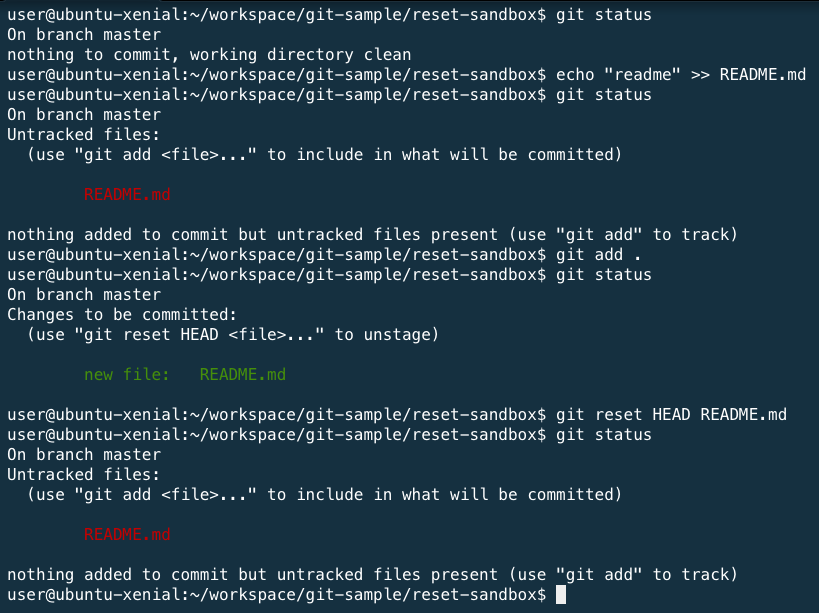
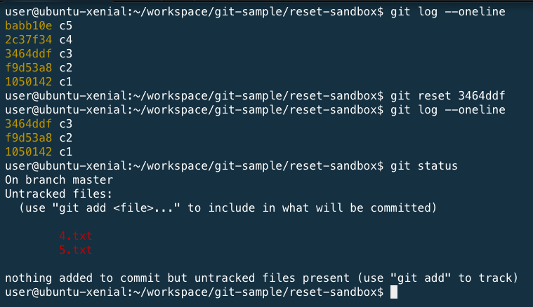

# 練習題：reset

### 1. 情境：將新增並已加入索引的檔案，還原到沒加入索引之前

1. 新增一個 README2.md
1. 透過 `git add README2.md` 指令，將修改的內容加入索引。
1. 透過 `git status` 指令，查看目前檔案狀態。
1. 透過 `git reset HEAD README2.md` 指令，將檔案變成 Unstaged (移除索引)。

### 2. 情境：重新 commit，並讓不該存在的檔案消失

1. 新增 1 個 commit 紀錄
1. 編輯 m1.md
1. 加入 hello 文字
1. 並 commit 進去
1. 透過 `reset --hard HEAD^` 指令，還原到前一個 commit 狀態，並把上一次的變更清除。

<!-- 
解答

echo "1" >> m1.md && git add . && git commit -m 'm1'
vi m1.md
git commit -m 'update'
git reset --hard HEAD^
 -->
