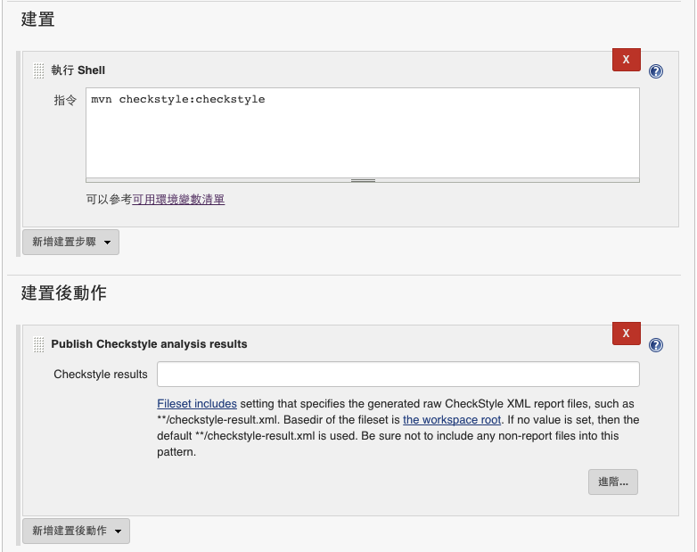
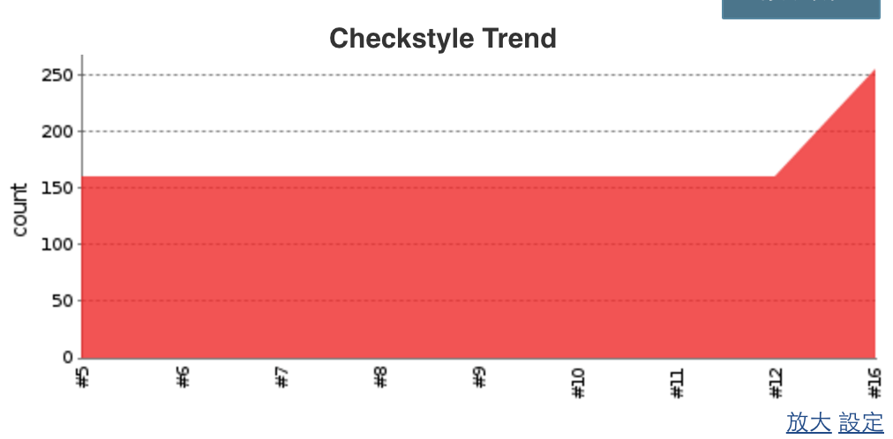
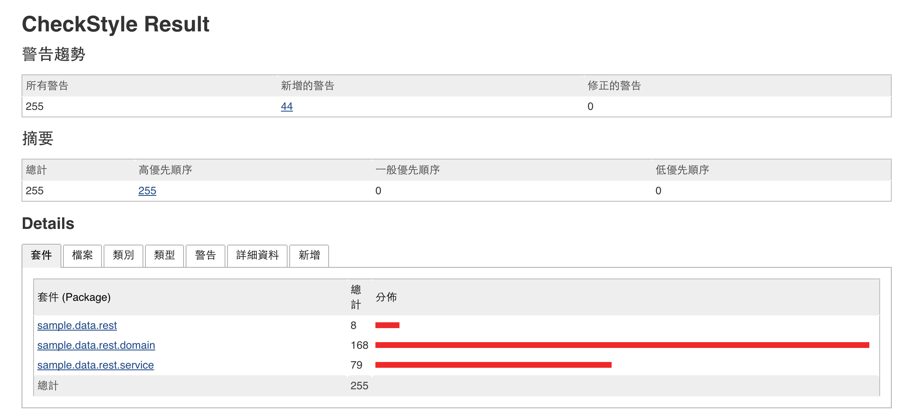
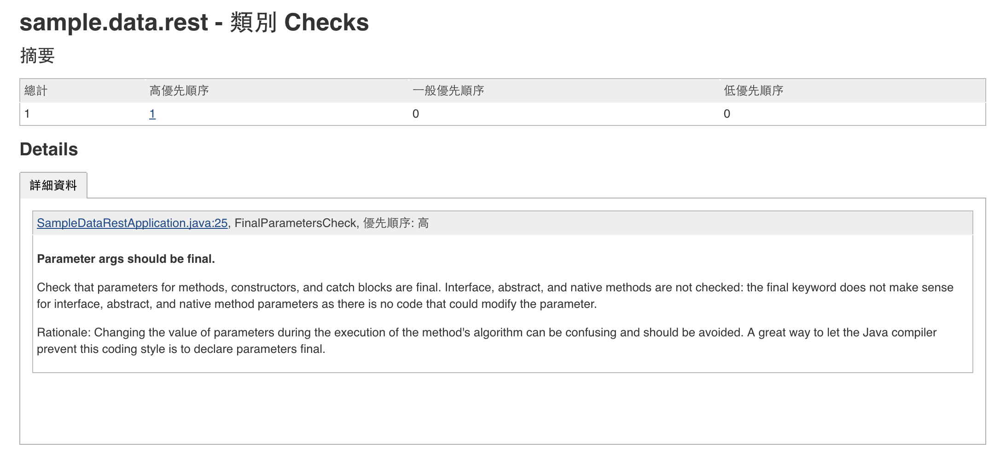
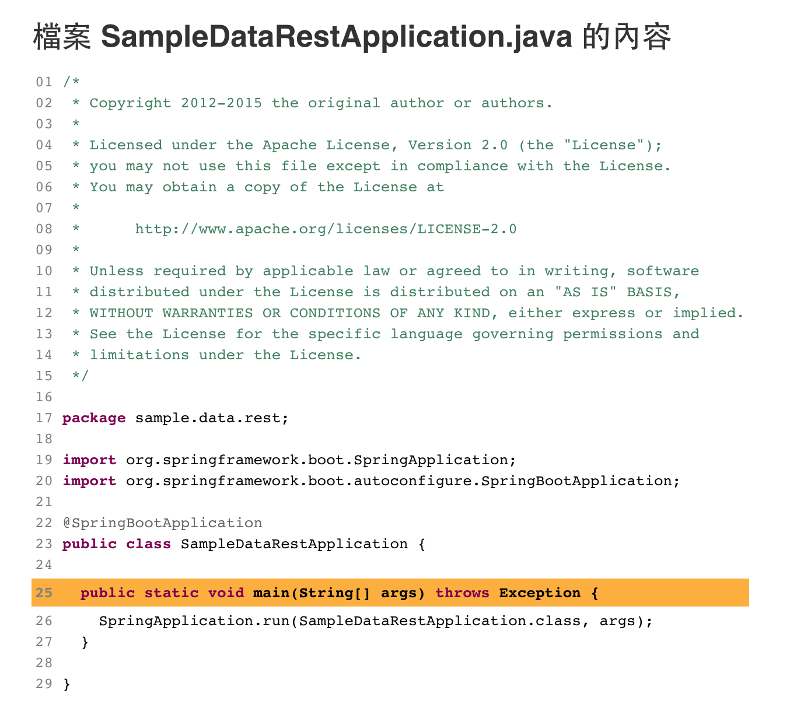

# checkStyle

## maven POM.xml 設定

透過 maven POM.xml 定義，可以讓我們使用 mvn 指令來進行 checkStyle

```
<plugin>
  <groupId>org.apache.maven.plugins</groupId>
  <artifactId>maven-checkstyle-plugin</artifactId>
  <version>2.9.1</version>
  <executions>
      <execution>
      <id>checkstyle</id>
      <phase>validate</phase>
      <goals>
          <goal>check</goal>
      </goals>
      <configuration>
          <failOnViolation>false</failOnViolation>
      </configuration>
      </execution>
  </executions>
</plugin>
```

執行 `mvn checkstyle:checkstyle` 來進行 checkstyle 的執行

可以在 `${project_home}/target/site/checkstyle.html` 檢視 report 的產出。

而用於 jenkins 產出 report 所需的 xml 檔案路徑為 `target/checkstyle-result.xml`

## 利用 Jenkins 產出 Report



若 `Checkstyle results` 沒有設置的情況下，預設為 `**/checkstyle-result.xml`

故這邊不做設置，剛好符合 report 產出位置。

產出相關報表如下：








