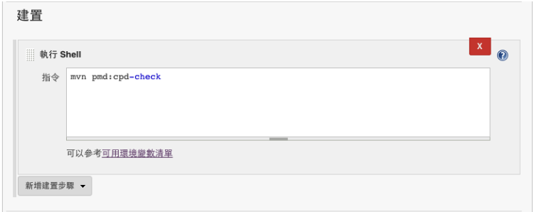
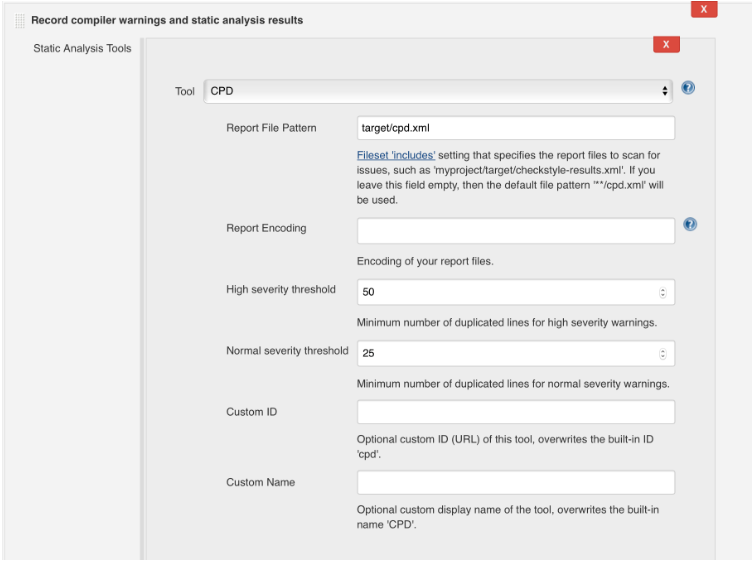
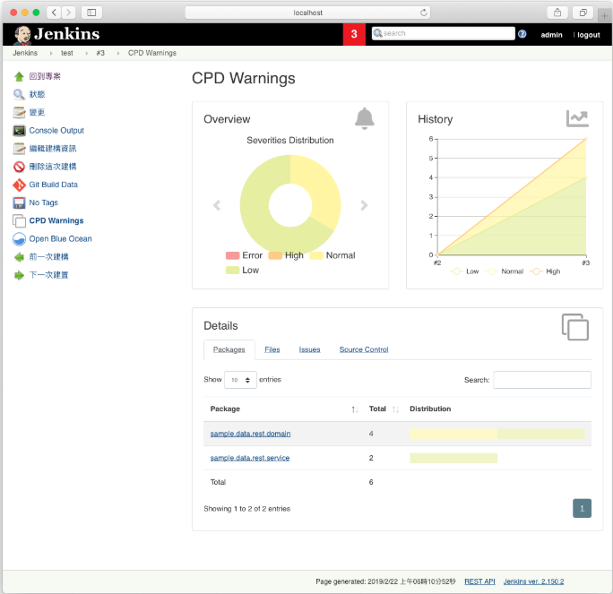
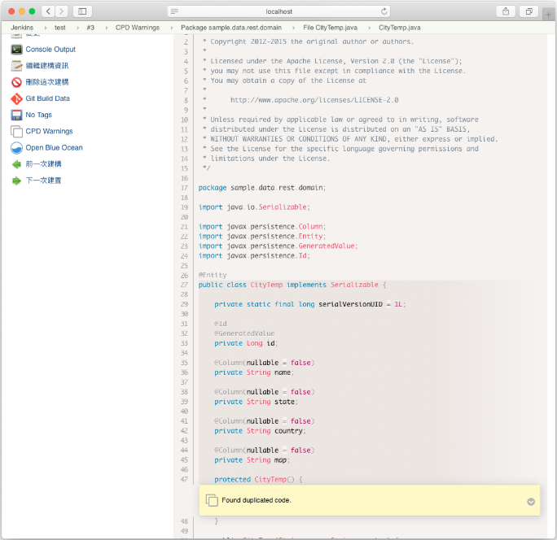

# dry / CPD

檢查源碼內重覆的部分

搭配 Warnings Next Generation plugin 使用，套件網址：

https://plugins.jenkins.io/warnings-ng

## maven POM.xml 設定
```
<plugin>
   <groupId>org.apache.maven.plugins</groupId>
   <artifactId>maven-pmd-plugin</artifactId>
   <version>3.6</version>
   <configuration>
      <linkXref>true</linkXref>
      <sourceEncoding>utf-8</sourceEncoding>
      <minimumTokens>20</minimumTokens>
      <format>xml</format>
      <failOnViolation>false</failOnViolation>
   </configuration>
   <executions>
      <execution>
        <phase>compile</phase>
        <goals>
          <goal>cpd</goal>
          <goal>cpd-check</goal>
        </goals>
      </execution>
   </executions>
</plugin>
```

設置好之後，我們可以透過 `mvn pmd:cpd-check` 指令來進行檢查

其中 `<minimumTokens>20</minimumTokens>` 可以讓你設置最小重覆的字數，以便設定檢查範圍

運行完檢查後，我們可以透過 `${project_home}/target/site/cpd.html` 來查看報表

若要透過套件產生 report 所需的 xml 檔案路徑為 `${project_home}/target/cpd.xml`

## 使用 Jenkins 進行 check 並產生報表

首先設置執行檢查指令：

`mvn pmd:cpd-check`



指定到 CPD 產出原始 XML 報告檔的檔案集，例如 **/cpd.xml。檔案集起算目錄就是工作區根目錄。如果沒有設定，預設會是 **/cpd.xml

參考報表輸出設置畫面如下：



相關報表畫面如下：






## 參考資料

<http://kentyeh.github.io/mavenStartup>
