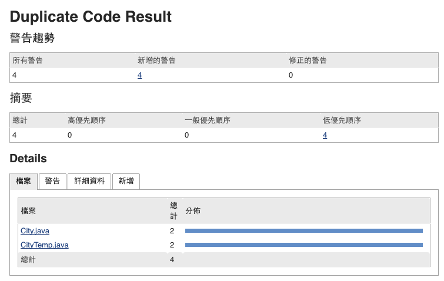

# Simian - Similarity Analyser

Simian 與 [CPD](../cpd/README.md) 功能類似，只支援 maven 1 所以在比較心得專案沒辦法透過設定 POM.xml 的方式來進行。

不過我們還是可以透過 command 的方式來產生相關報表，指令如下

```
wget -nc http://www.harukizaemon.com/simian/simian-2.4.0.tar.gz
tar xvzf simian-2.4.0.tar.gz bin/simian-2.4.0.jar
mv bin/simian-2.4.0.jar ./simian.jar
java -jar simian.jar \
-formatter=xml:target/simian.xml \
-threshold=10 \
-language=java \
**/*.java
```

如此我們就可以產出 `${project_home}/target/simian.xml` 令 jenkins 可以進行報表輸出

## jenkins 報表輸出設置


相關報表產出如下：





