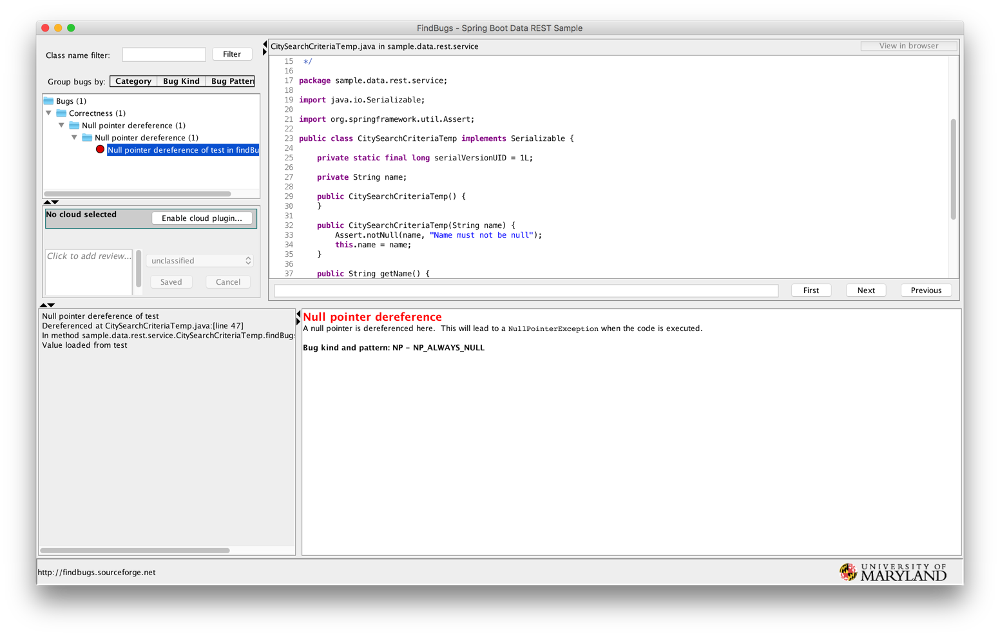
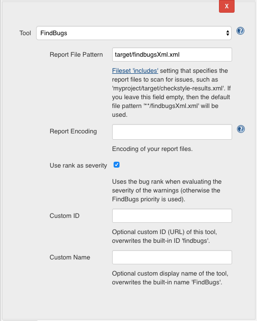
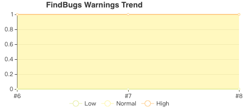
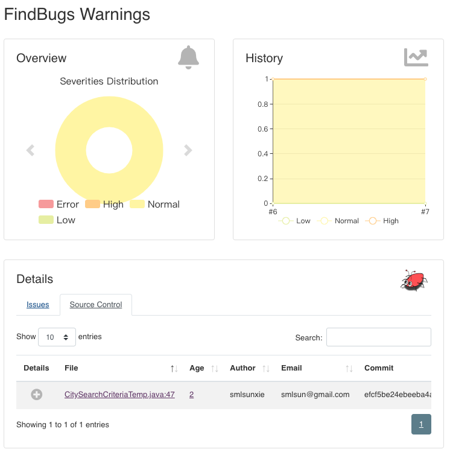
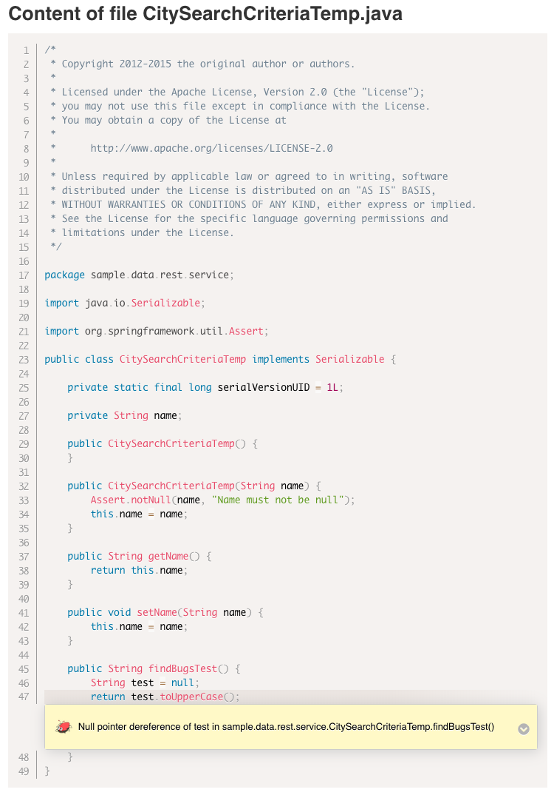

# FindBugs

FindBugs 檢測的標的不是源碼，而是 binary code，因此要先打包好專案才能執行檢查。

搭配 Warnings Next Generation plugin 使用，套件網址：

https://plugins.jenkins.io/warnings-ng

## maven POM.xml 設定

```
<plugin>
    <groupId>org.codehaus.mojo</groupId>
    <artifactId>findbugs-maven-plugin</artifactId>
    <version>3.0.1</version>
    <executions>
        <execution>
            <goals>
                <goal>check</goal>
            </goals>
        </execution>
    </executions>
    <configuration>
        <effort>Max</effort><!--檢測的程度，值可為Min、Default或是Max-->
        <xmlOutput>true</xmlOutput>
        <failOnError>false</failOnError>
    </configuration>
</plugin>
```

設置好 POM.xml 後，我們可以透過 `mvn package findbugs:check` 來產出報表。

當檢測出缺點時，我們可以用指令 `mvn findbugs:gui` 透過 GUI 查看 xml 的輸出，畫面如下




## 使用 Jenkins 進行 check 並產生報表

首先設置執行檢查指令：

`mvn package findbugs:check`


指定到 FindBugs 產出原始 XML 報告檔的檔案集，例如 **/findbugs.xml 或 **/findbugsXml.xml。檔案集起算目錄就是工作區根目錄。如果沒有設定，預設會依據是 Maven 或 Ant 建置，使用 **/findbugsXml.xml 或 **/findbugs.xml。

因為我們是使用 maven 所以這邊需要設置為 `**/findbugsXml.xml`

報表設置畫面如下：



相關報表畫面如下：







## 參考資料

<http://kentyeh.github.io/mavenStartup>
