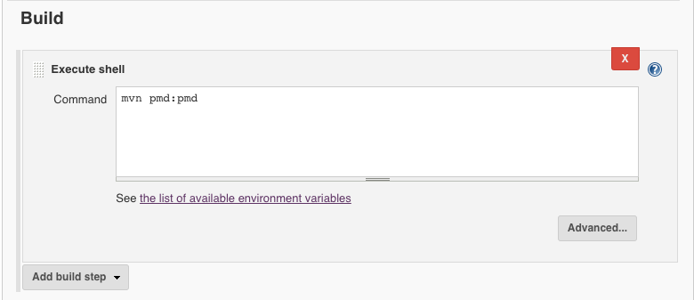

# PMD

PMD 是一套原始碼檢查的工具。我們可以它檢查原始碼，如：未使用的 variables, 空的 catch blocks, 不需要被建立的 object，並產生建議報告。

搭配 Warnings Next Generation plugin 使用，套件網址：

https://plugins.jenkins.io/warnings-ng

## maven POM.xml 設定
```
<plugin>
   <groupId>org.apache.maven.plugins</groupId>
   <artifactId>maven-pmd-plugin</artifactId>
   <version>3.6</version>
   <configuration>
      <linkXref>true</linkXref>
      <sourceEncoding>utf-8</sourceEncoding>
      <minimumTokens>20</minimumTokens>
      <format>xml</format>
      <failOnViolation>false</failOnViolation>
   </configuration>
   <executions>
      <execution>
        <phase>compile</phase>
        <goals>
          <goal>pmd</goal>
          <goal>check</goal>
        </goals>
      </execution>
   </executions>
</plugin>
```
設置好 POM.xml 之後，可以透過 `mvn pmd:pmd` 來產生 PMD 報表。

參考下圖進行設置：



檢視 html 報表可以透過 `${project_home}/target/site/pmd.html` 來存取

若要透過套件產生 report 所需的 xml 檔案路徑為 `${project_home}/target/pmd.xml`

## 使用 jenkins 設置產生報表

指定到 PMD 產出原始 XML 報告檔的檔案集，例如 **/pmd.xml。檔案集起算目錄就是工作區根目錄。如果沒有設定，預設會是 **/pmd.xml

參考下圖進行報表輸出設置：


報表呈現如下：


