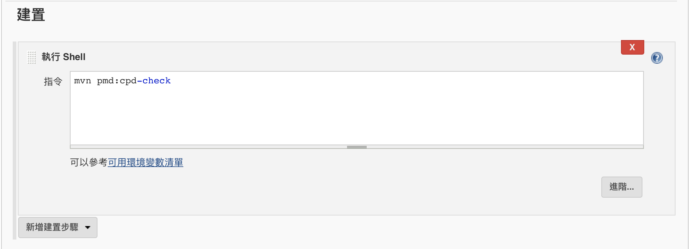
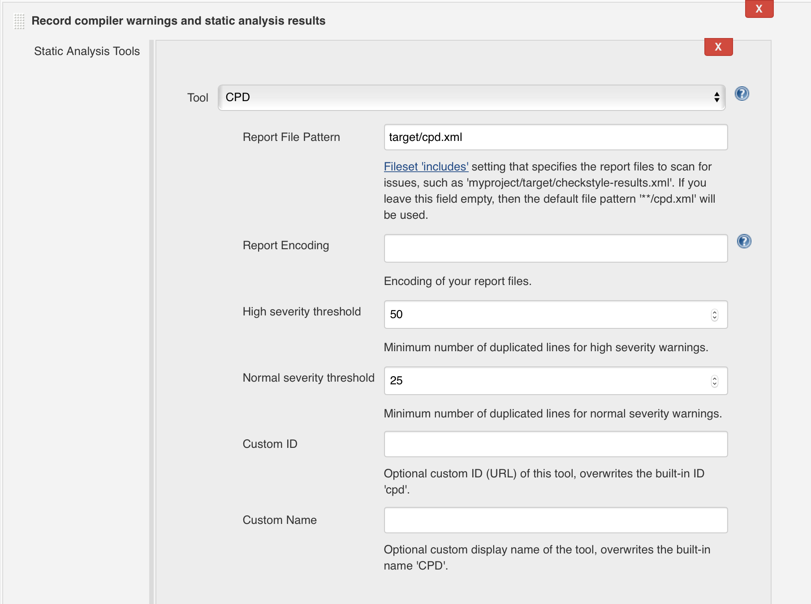
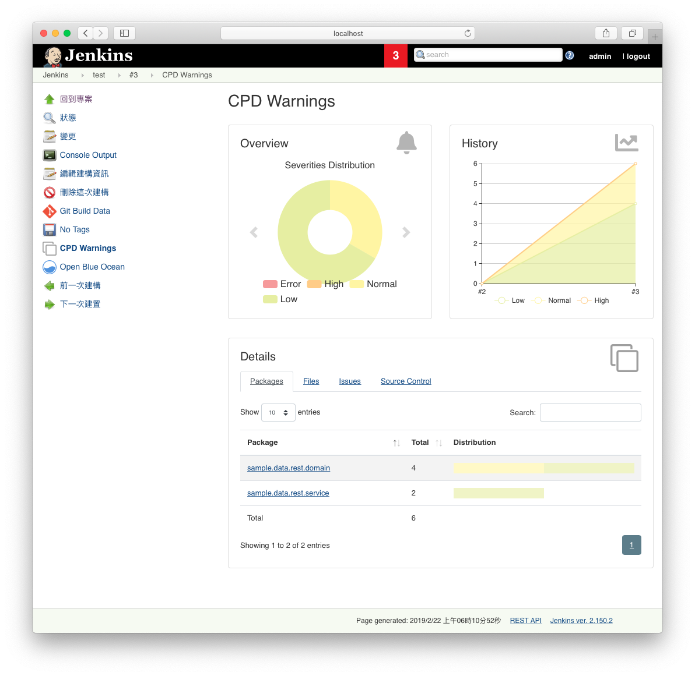
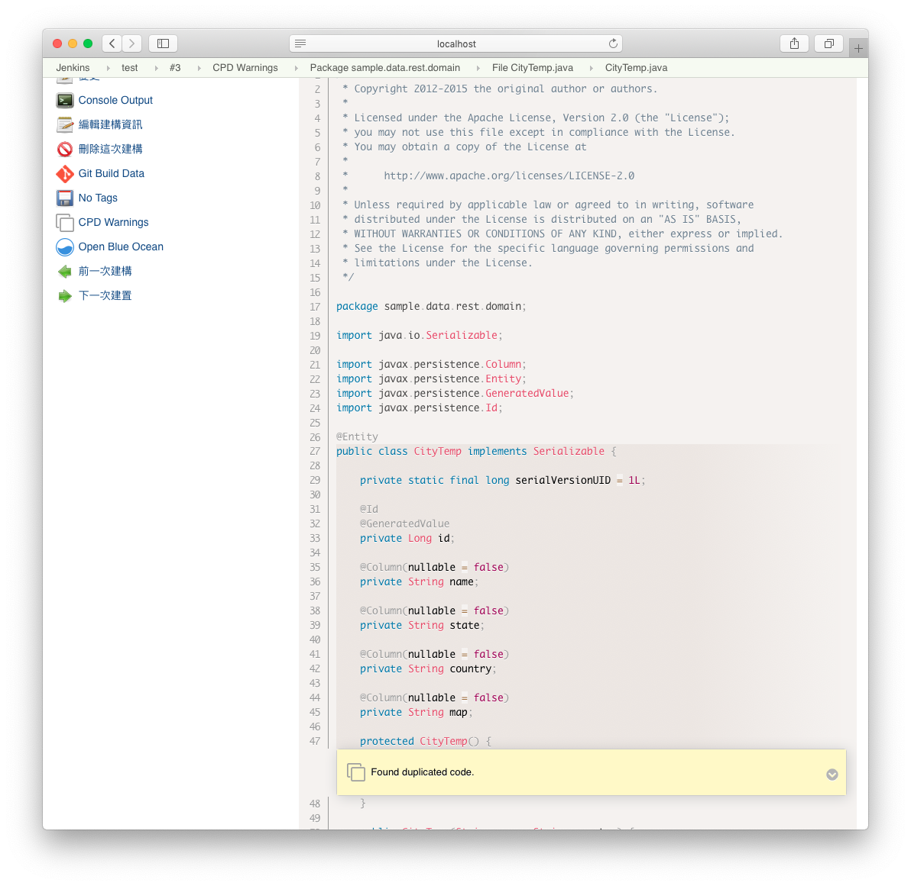

## Jenkins 靜態程式碼分析套件，Warnings Next Generation plugin 使用

Jenkins 的 Warnings Next Generation plugin，用於收集靜態分析工具報告的編譯器警告或問題，並將其結果輸出為可視化報表。 

該套件內建了對近百個靜態分析工具（包括幾個不同編譯器）的支源。

參閱支援的 report 格式列表: https://github.com/jenkinsci/warnings-ng-plugin/blob/master/SUPPORTED-FORMATS.md

它取代了 Jenkins 靜態分析相關套件存在已有十多年過時的 plugin 如下：

* Android Lint
* CheckStyle
* Dry
* FindBugs
* PMD
* Warnings
* Static Analysis Utilities
* Static Analysis Collector Plugins
* Task Scanner

套件官方網址： https://plugins.jenkins.io/warnings-ng


## 基本使用方式

根據不同的靜態分析，搭配不同的語言會有不同的設置方式，以 PMD 搭配 Dry(檢查程式碼重複) 為例，在 maven 專案之 pom.xml 加入下面設置。

```
<plugin>
   <groupId>org.apache.maven.plugins</groupId>
   <artifactId>maven-pmd-plugin</artifactId>
   <version>3.6</version>
   <configuration>
      <linkXref>true</linkXref>
      <sourceEncoding>utf-8</sourceEncoding>
      <minimumTokens>20</minimumTokens>
      <format>xml</format>
      <failOnViolation>false</failOnViolation>
   </configuration>
   <executions>
      <execution>
        <phase>compile</phase>
        <goals>
          <goal>cpd</goal>
          <goal>cpd-check</goal>
        </goals>
      </execution>
   </executions>
</plugin>
```

透過該設置之後可以直接運行下面指令檢查：

`mvn pmd:cpd-check`

其中 `<minimumTokens>20</minimumTokens>` 可以讓你設置最小重覆的字數，以便設定檢查範圍

運行完檢查後，我們可以透過 `${project_home}/target/site/cpd.html` 來查看報表

若要透過套件產生 report 所需的 xml 檔案路徑為 `${project_home}/target/cpd.xml`

接著進行 Jenkins jobs 的設置，記得先安裝 Warnings Next Generation 套件，我們可以在 job 進行報表設置。

第一步設置 job 執行 shell:



第二步設置報表產出：



一旦執行成功，將可以看到下面的圖表產出





官方可支援的 report 非常豐富，因為整合為同一個套件，相關的設置的方式大同小異，早期套件不再支援 Jenkins 2.0 之 pipeline 的建置語法，使用 Warnings Next Generation plugin 則可以直接使用於 pipeline 之建置，詳細可參考官方的文件說明：

https://github.com/jenkinsci/warnings-ng-plugin/blob/master/doc/Documentation.md

及在 pipeline script 使用上，詳細參數說明

https://jenkins.io/doc/pipeline/steps/warnings-ng/