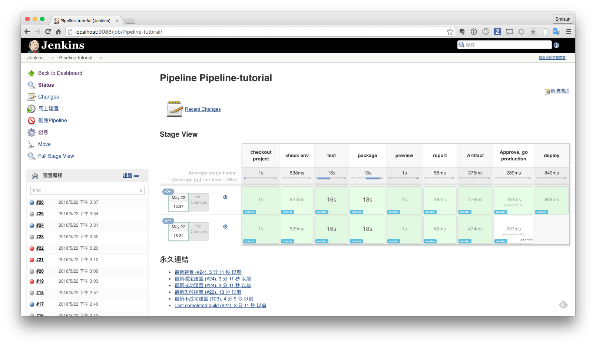

# 使用 Pipeline 進行建置

我們可以把前面章節所完成的相關 task 濃縮為單一個 Jenkinsfile

```
node {

  stage 'checkout project'
  git url: 'https://github.com/agileworks-tw/spring-boot-sample.git'

  stage 'check env'

  sh "mvn -v"
  sh "java -version"

  stage 'test'
  sh "mvn test"

  stage 'package'
  sh "mvn package"

  stage 'preview'
  sh 'make deploy-default'

  stage 'report'
  step([$class: 'JUnitResultArchiver', testResults: '**/target/surefire-reports/TEST-*.xml'])

  stage 'Artifact'
  step([$class: 'ArtifactArchiver', artifacts: '**/target/*.jar', fingerprint: true])

  try{
    stage 'Approve, go production'
    def url = 'http://localhost:8000/'
    input message: "Does staging at $url look good? ", ok: "Deploy to production"
  }finally{
    sh "ssh jenkins@localhost 'kill `cat deploy/release/run.pid`'"
  }

  stage 'deploy'
  sh 'make deploy-default'
}
```

執行結果如下


