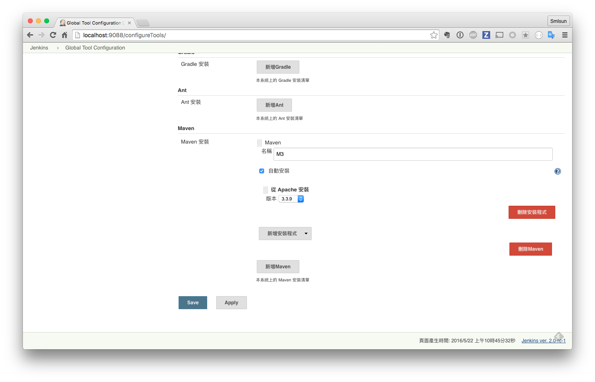
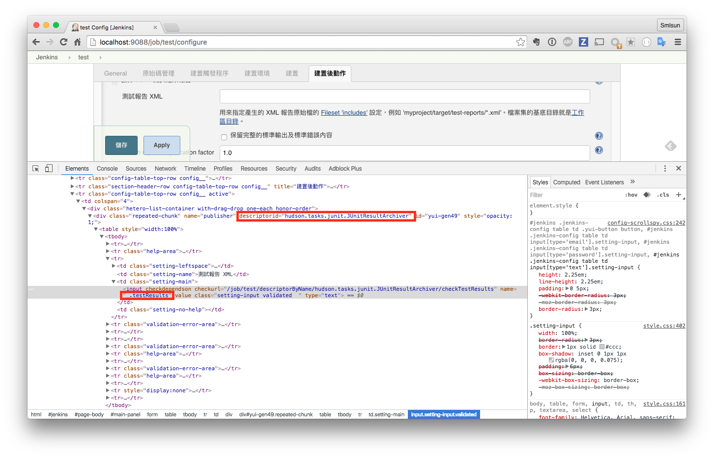
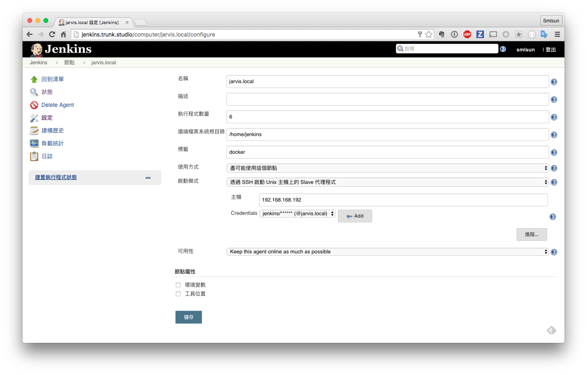
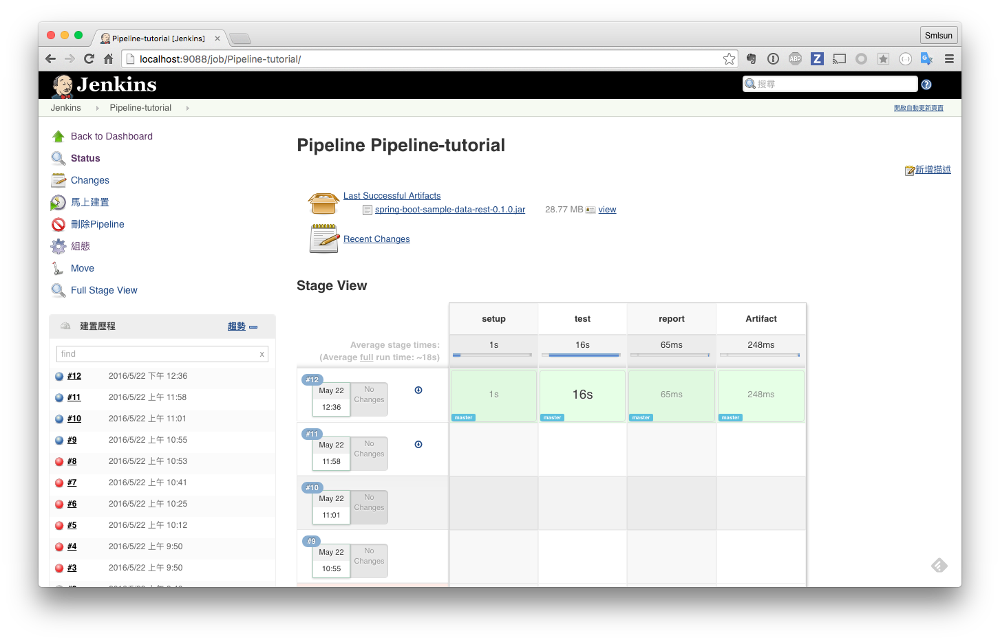

# Pipeline 使用

Pipeline 是以 Groovy Script 作為撰寫，為 Java 的動態語言。

## 第一個 Pipeline: Hello World

```
echo 'hello from Pipeline'
```

### 執行結果

```
Started by user anonymous
[Pipeline] echo
hello from Pipeline
[Pipeline] End of Pipeline
Finished: SUCCESS
```

以上面的例子來說，完整的語法為：

```
echo("hello from Pipeline");
```

我們可以省略 `;`, `()` 並且  `''`, `""` 皆可以使用。


## 建立簡單的 Pipeline

```
node {
  git url: 'https://github.com/agileworks-tw/spring-boot-sample.git'
  def mvnHome = tool 'M3'
  sh "${mvnHome}/bin/mvn test"
}
```

其中


```
git url: 'https://github.com/agileworks-tw/spring-boot-sample.git'
```

也可以指定 branch，指令如下


```
git url: 'https://github.com/agileworks-tw/spring-boot-sample.git', branch: 'master'
```

若沒有指定的話，預設為 Master，完整程式碼如下

```
git([url: 'https://github.com/agileworks-tw/spring-boot-sample.git', branch: 'master'])
```


tool 實際上是讀取 jenkins 中的 `Global Tool Configuration` 所設定的建置工具，如下圖：



`def mvnHome = tool 'M3'`

就是取得該 tool 定義的結果來進行專案建置。

而下面指令

```
sh "${mvnHome}/bin/mvn test"
```

則為使用該 tool 利用 mvn 進行專案 test，而實際指令為

```
sh([script: mvnHome + '/bin/mvn test'])
```

可以看到簡化不少


for windows 可以改為

```
bat "${mvnHome}\\bin\\mvn test"
```

## 管理環境變數

在 Pipeline 我們可以使用 env 來存取 jenkins 所設置的環境變數，我們也可以使用 env 來設置新的環境變數。

延續上一個範例：

```
node {
  git url: 'https://github.com/agileworks-tw/spring-boot-sample.git'
  def mvnHome = tool 'M3'
  env.PATH = "${mvnHome}/bin:${env.PATH}"
  sh 'mvn test'
}
```

透過 env 的使用，我們就不需要使用 `${mvnHome}/bin/mvn` 這麼長的程式路徑。

上述的處理方式，只有當你使用但一 slave 時比較沒有問題，有時候我們需要指定某項建置需要特定的環境變數時，我們可以改為

```
node {
  git url: 'https://github.com/agileworks-tw/spring-boot-sample.git'
  withEnv(["PATH+MAVEN=${tool 'M3'}/bin"]) {
    sh 'mvn test'
  }
}
```
`withEnv(["PATH+MAVEN=${tool 'M3'}/bin"]) {` 得意思就是原有的 `PATH` 變數，加上新的 `Maven` 環境變數

如此就可以限制該環境變數限制在特定的 scope 一但執行完成，環境變數就會還原成原本的內容。

除此之外，一些 Jnekins 本來在建置過程中就會可用的變數也可以透過 env 直接存取，比如 `env.BUILD_TAG` 可在 groovy script 中使用，或是在 `sh` 時使用 `$BUILD_TAG` 進行該變數存取。


## 紀錄測試結果，以及建置封存

```
node {
  git url: 'https://github.com/agileworks-tw/spring-boot-sample.git'
  def mvnHome = tool 'M3'
  sh "${mvnHome}/bin/mvn test package"
  step([$class: 'ArtifactArchiver', artifacts: '**/target/*.jar', fingerprint: true])
  step([$class: 'JUnitResultArchiver', testResults: '**/target/surefire-reports/TEST-*.xml'])
}
```

其中 `$class` 為縮寫，以 JUnitResultArchiver 為例，完整路徑為 `hudson.tasks.junit.JUnitResultArchiver`

可以從 jenkins UI 找到一些線索，如下圖：



## 指定特定 Slave 進行建置


假設已經有設置 jenkins slave 節點
```
node('master') {
    // as before
}
```
我們可以透過上述方式指定特定的 node 進行建置，若沒有指定將由 jenkins 自行判斷

除了節點的 name，也可以指定特定的 label，如

```
node('unix && 64bit') {
    // as before
}
```

定義方式可參考下圖



若點選建置，你將可以看到下列訊息輸出


`Running on <yourslavename> in /<slaveroot>/workspace/<jobname>`


## 中途暫停

```
node('remote') {
  input 'Ready to go?'
  // rest as before
}
```

使用情境如：用於確認 QA 是否正確，若確認完成進行 production deploy，又或者輸入特定參數。

## 使用 try... catch... final

我們在進行建置時，就像在寫程式一樣，一定會有另外產生，同樣我們可以透過 `try... catch... final` 來定義，如：

```
try{
  stage 'Approve, go production'
  def url = 'http://localhost:8000/'
  input message: "Does staging at $url look good? ", ok: "Deploy to production"
}finally{
  sh "docker-compose stop server"
}
```

使用 docker 進行 QA 驗證，無論最後是否要要進行 production deploy 皆需要將 docker 停止。

## stage 定義

stage 的定義，可以讓你的建置步驟更清楚，可讀性更好

```
node {
  stage 'setup'
  git url: 'https://github.com/agileworks-tw/spring-boot-sample.git'
  def mvnHome = tool 'M3'

  stage 'test'
  sh "${mvnHome}/bin/mvn test package"


  stage 'report'
  step([$class: 'JUnitResultArchiver', testResults: '**/target/surefire-reports/TEST-*.xml'])

  stage 'Artifact'
  step([$class: 'ArtifactArchiver', artifacts: '**/target/*.jar', fingerprint: true])

}
```

且 jenkins 在 task 中 stage view 進度上可以看到每個 stage 的執行過程與結果，如下圖：


