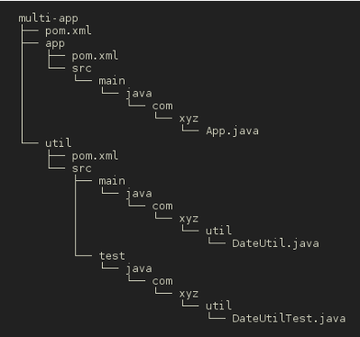

# Maven Multi Module Project

## 範例專案

<https://github.com/agileworks-tw/maven-multi-app-sample>

## 範例專案檔案結構

由下圖可以看到，此範例專案是有 app 及 util 所組成，相關設定將會由 `multi-app/pom.xml` 進行組合



## multi-app/pom.xml

```
<project xmlns="http://maven.apache.org/POM/4.0.0" xmlns:xsi="http://www.w3.org/2001/XMLSchema-instance"
        xsi:schemaLocation="http://maven.apache.org/POM/4.0.0 http://maven.apache.org/maven-v4_0_0.xsd">

        <modelVersion>4.0.0</modelVersion>

        <!-- project coordinates -->
        <groupId>com.xyz</groupId>
        <artifactId>multi-app</artifactId>
        <version>1.0</version>
        <packaging>pom</packaging>

        <modules>
                <module>app</module>
                <module>util</module>
        </modules>

</project>
```

其中

```
<modules>
        <module>app</module>
        <module>util</module>
</modules>
```
而其中 app 及 util 之 pom.xml 則與一般標準 pom.xml 設置上無異。

在 `multi-app/pom.xml` 可以透過 modules 來設定建置此專案需要的其他專案。

## 運行

```
git clone https://github.com/agileworks-tw/maven-multi-app-sample
cd maven-multi-app-sample
mvn test
```

運行結果如下

```
[INFO] Reactor Summary:
[INFO]
[INFO] multi-app .......................................... SUCCESS [  0.002 s]
[INFO] util ............................................... SUCCESS [  1.469 s]
[INFO] app ................................................ SUCCESS [  0.035 s]
[INFO] ------------------------------------------------------------------------
[INFO] BUILD SUCCESS
[INFO] ------------------------------------------------------------------------
[INFO] Total time: 1.594 s
[INFO] Finished at: 2016-08-01T08:39:39+08:00
[INFO] Final Memory: 15M/211M
[INFO] ------------------------------------------------------------------------
```

## 參考資料

<http://books.sonatype.com/mvnex-book/reference/multimodule-sect-intro.html>
<http://www.codetab.org/apache-maven-tutorial/>
<http://www.codetab.org/apache-maven-tutorial/maven-multi-module-project/>
