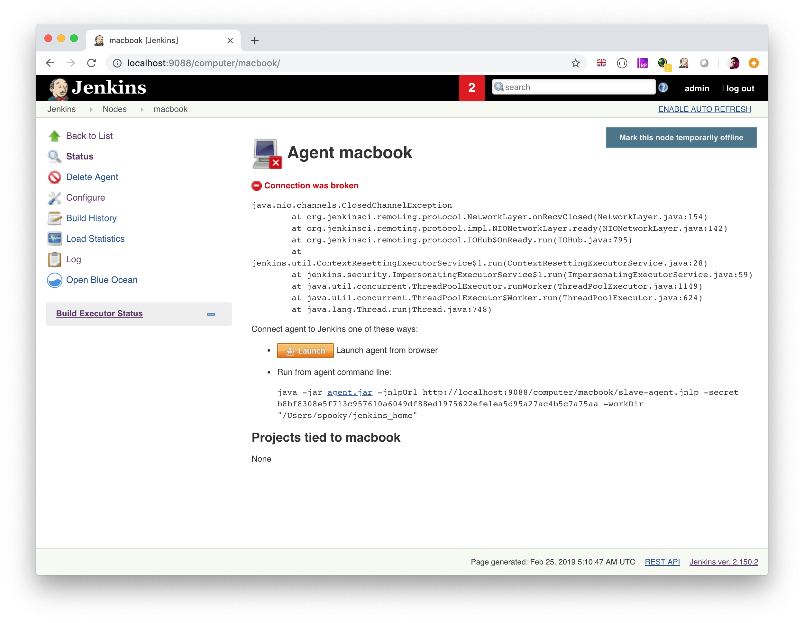

Master/slave
============

節點套件安裝
------------

```
sudo apt-get update
sudo apt-get upgrade
sudo apt-get install default-jre
```

節點使用者設定 ssh
------------------

新增你要用來執行 slave 的 user，e.g. slave

參考 [ssh](./ssh) 進行設定

jenkins slave 設置
------------------


slave 無網路情形
----------------

首先需要先開啟 TCP port for JNLP agents


點選 node 節點可以看到引導，如下圖



點選畫面中 agent.jar 下載連結，每個 jenkins 會因為安裝位置會有所不同

在欲作為 slave 的機器執行下面指令，即可完成 slave 啟動

```
java -jar agent.jar -jnlpUrl http://localhost:9088/computer/macbook/slave-agent.jnlp -secret b8bf8308e5f713c957610a6049df88ed1975622efe1ea5d95a27ac4b5c7a75aa -workDir "/Users/spooky/jenkins_home"

```

