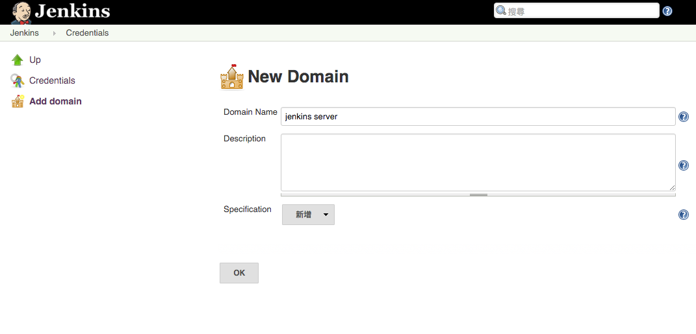
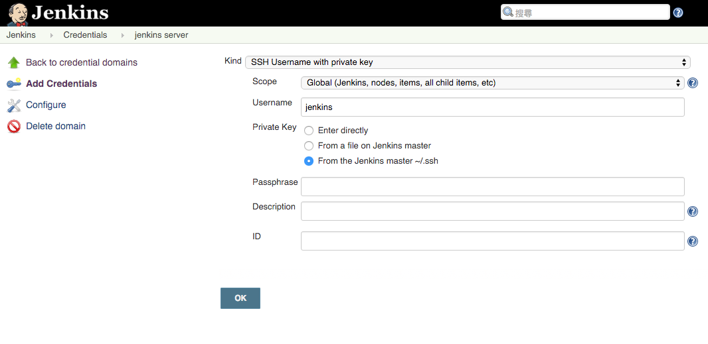

SSH
===

為 Jenkins User 建立 SSH Keys
-----------------------------

SSH 在自動化的過程扮演很重要的角色，因此我們需要先將 jenkins 的 ssh key 產生出來

### 透過 jenkins user 建立 ssh key

首先透過下面指令切換到 jenkins 這個 user

`sudo su - jenkins`

接著透過下面指令產生 ssh key

`ssh-keygen -t rsa`

default 會產生在 `~/.ssh` 將會有 `id_rsa`, `id_rsa.pub` 這兩個檔案

### 將建立好的 public key 加入到要傳輸的目標機器

`cat ~/.ssh/id_rsa.pub >>~/.ssh/authorized_keys`

有了 ssh key 以便後續自動化進行處理，在 jenkins user 底下執行上述指令，也就表示：

> 把本機當作 stage machine

這樣做的好處是，一旦 stage machine 在其他位置

只要改變 ssh server ip 並且再把 id_rsa.pub 加入對象機器即可，其他程序皆相通

如此，可以透過下面指令進行登入

`ssh jenkins@localhost`

若設置正確，將不需要 password 即可成功登入。

除了可以登入遠端機器之外，我們可以透過 ssh 對遠端進行指令的執行，如：

`ssh jenkins@localhost id`

會看到類似下面的結果

`uid=112(jenkins) gid=117(jenkins) groups=117(jenkins),27(sudo),999(docker)`

### 使用 scp 傳輸檔案

scp 為用於檔案傳輸的指令，其所使用的驗證方式跟 ssh 一樣，因此只要 ssh key 設置好之後，使用 scp 也將不需要密碼

指令範例：

`scp filename jenkins@localhost:~/path/to/upload `

### ssh 與 scp 組合應用範例

此部分將展示如何使用 ssh 建立資料夾，再將檔案透過 scp 傳輸到對應的資料夾

```
touch test-upload-file.md
ssh jenkins@localhost mkdir ~/test-upload-folder
scp test-upload-file.md jenkins@localhost:~/test-upload-folder
ssh jenkins@localhost ls ~/test-upload-folder
```


Jenkins 設定 ssh credentials
----------------

若要在 Jenkins 串接其他服務需要用到 ssh 認證的狀況，可參考下面設置





新增 ssh server
---------------

我們可以先把 jenkins CI server 視為 development 測試環境，因此我們需要進行 ssh server 相關設置

相關設置參考：plugin/[publish over ssh](../plugin/publish-over-ssh.md) 透過該章節設置，我們可以確保 ssh 連結正常
