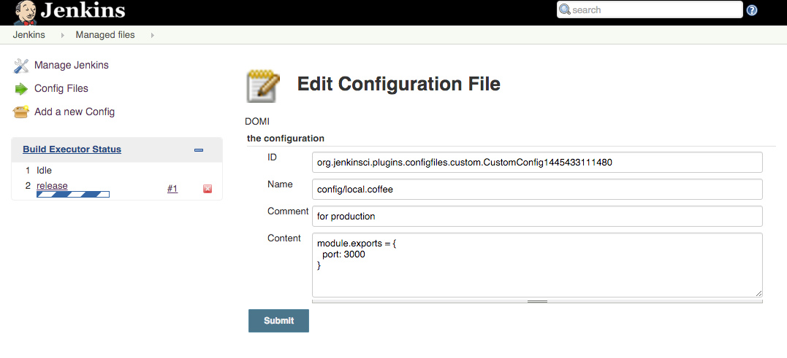

正式機部署
==========

task 設置
---------

基本設置與 task/[preview](preview.md) 基本上是一樣的

因為是 production 環境，所以我們需要將設定改為 production 機器專用

### 替換 Config

使用 [config-file-provider](../plugin/config-file-provider.md)

設置畫面如下：



假設 production 機器啟動後 port 為 8000

我們需要新增設定為 `application.properties`

並且在建置時替換建置專案底下之 `src/main/resources/application.properties`

令 production 相關設置生效。

### ssh publish setup

假設 preview 機器就是 production 機器

-	Name: 選擇在 [publish-over-ssh](../plugin/publish-over-ssh.md) 建置的 ssh server
-	Source files: target/spring-boot-sample-data-rest-0.1.0.jar
-	Remote directory: deploy/release

### production release 執行指令

基本指令跟 preview 很像，資料夾是不一樣的

```
cd deploy/release

kill `cat run.pid` || true
kill `cat ../preview/run.pid` || true

java -jar target/spring-boot-sample-data-rest-0.1.0.jar > /dev/null 2>&1 & echo $! > run.pid
```

透過這些 task 的設置就把整個開發流程自動化完成。
