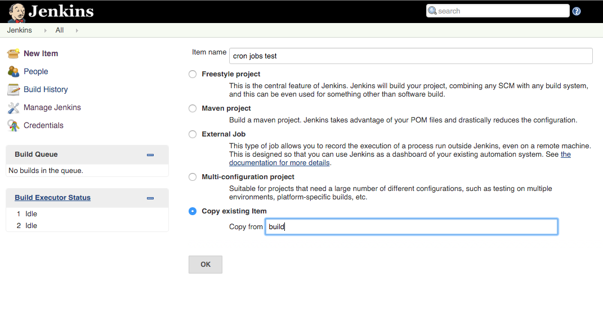
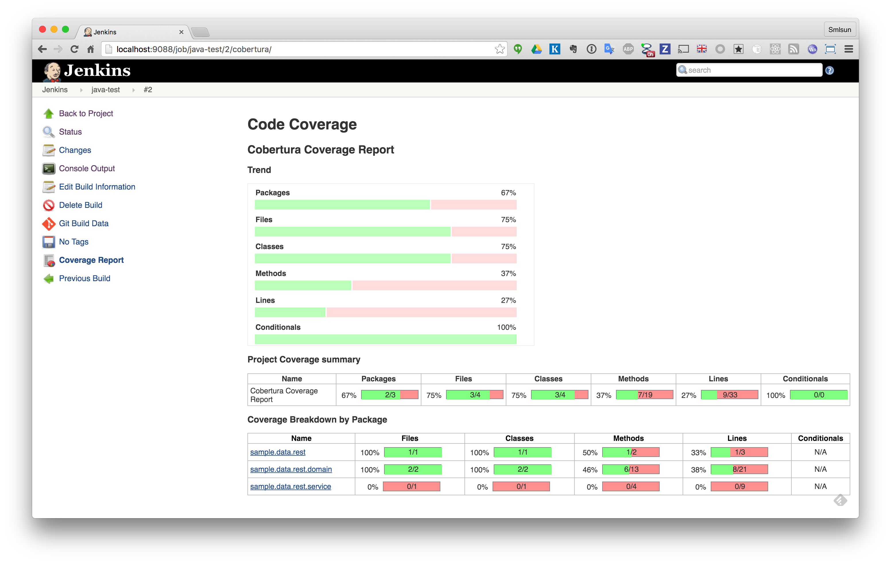

# test

延續 task/[build](./build.md)

我們可以建置透過 build task 直接複製如下圖：



## 建置指令

```
#!/bin/bash
mvn clean cobertura:cobertura test
```

## 設置 Cobertura 呈現測試覆蓋率

report 位置：`target/site/cobertura/coverage.xml`

## 執行結果


