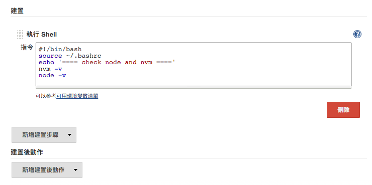

Task 實作以 Node.js 為例
========================

建立建置環境所需 library
------------------------

### 安裝 nvm

本實戰將會以 NodeJS 為例，因此我們需要先把需要的版本安裝完成，透過 nvm 來進行 NodeJS 安裝，指令如下：

```
touch ~/.bashrc
curl -o- https://raw.githubusercontent.com/creationix/nvm/v0.29.0/install.sh | bash
```

安裝完之後會在 jenkins user 的 `~/.bashrc` 寫入下列指令

```
export NVM_DIR="/var/lib/jenkins/.nvm"
[ -s "$NVM_DIR/nvm.sh" ] && . "$NVM_DIR/nvm.sh"  # This loads nvm
```

這段最主要的用意就是要把 nvm 載入，之所以需要寫入 `~/.bashrc` 就是要在登入時將 nvm 載入。

如此我們就可以再不依賴 jenkins CI 的 plugin 的協助快速的把開發環境所需資源安裝完成。

第一次安裝 nvm，因為我們是在登入後安裝完成，因此並不會執行到上述指令，透過 `source ~/.bashrc` 來載入

我們可以透過 `nvm --version` 確認已確實載入完成

### 安裝 NodeJS

`nvm install v4`

透過 nvm 的協助我們可以很方便進行 NodeJS 版本切換，這也會使我們在建置時可以很方便的切換版本。

如果你要設置某個版本為預設，可以使用下列指令

`nvm alias default v4`

如此我們可以確認一下目前 NodeJS 的版本

`node -v`

到這邊基本上基本環境已經有了

我們可以在 jenkins CI 建立一個 task 確認一下是否可以正確抓到 node

### jenkins CI check environment




```
#!/bin/bash
source ~/.bashrc
echo '==== check node and nvm ===='
nvm --version
node -v
```

執行結果如下：

```
Started by user anonymous
Building in workspace /var/lib/jenkins/jobs/check jenkins environment/workspace
[workspace] $ /bin/bash /tmp/hudson7479596903861655617.sh
==== check node and nvm ====
0.29.0
v1.8.4
Finished: SUCCESS
```
