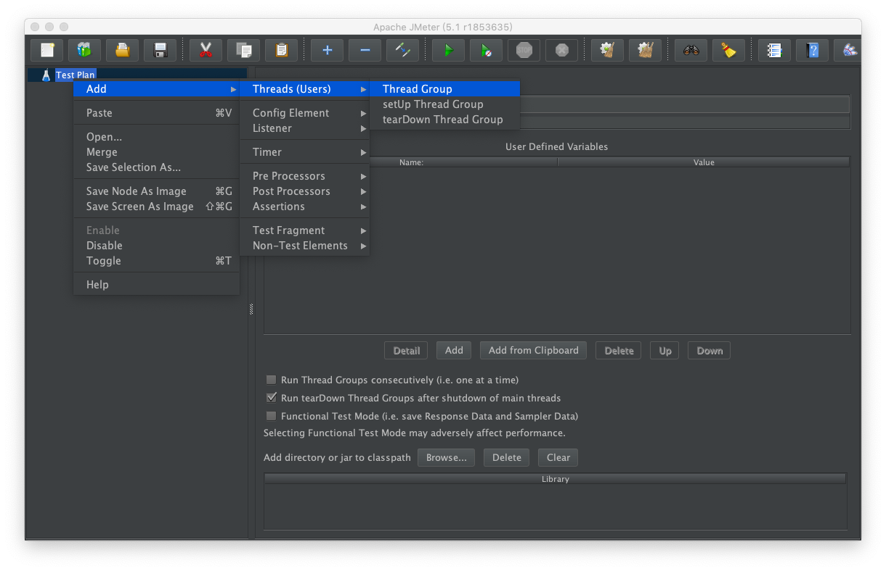
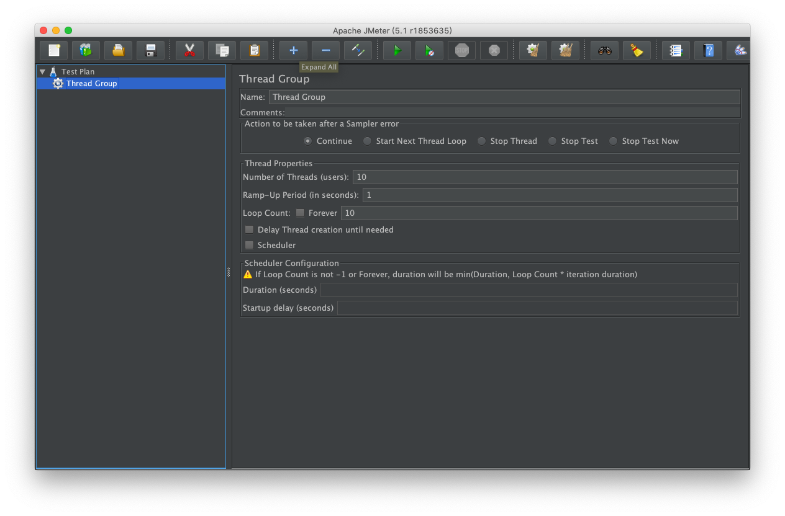
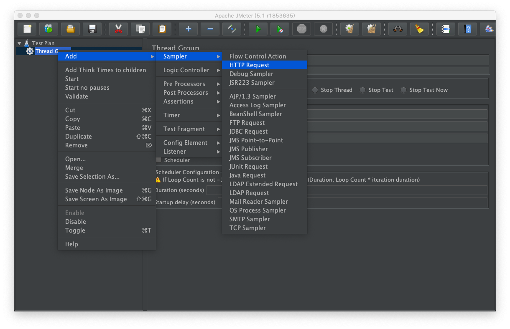
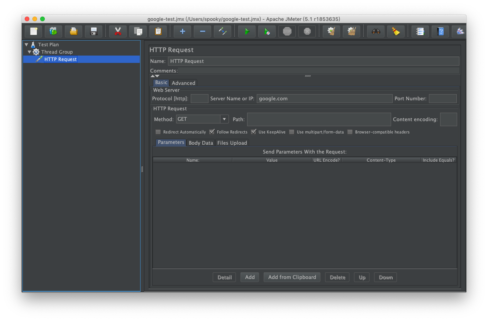
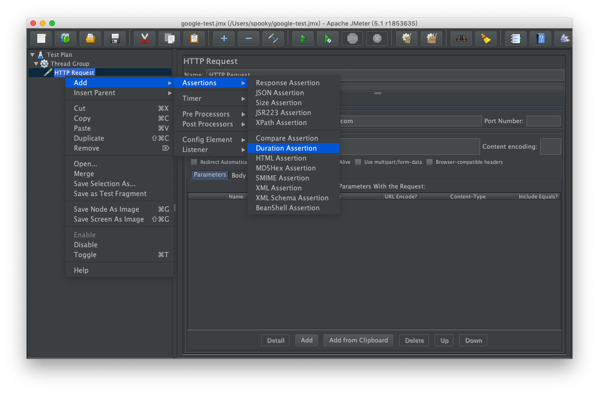
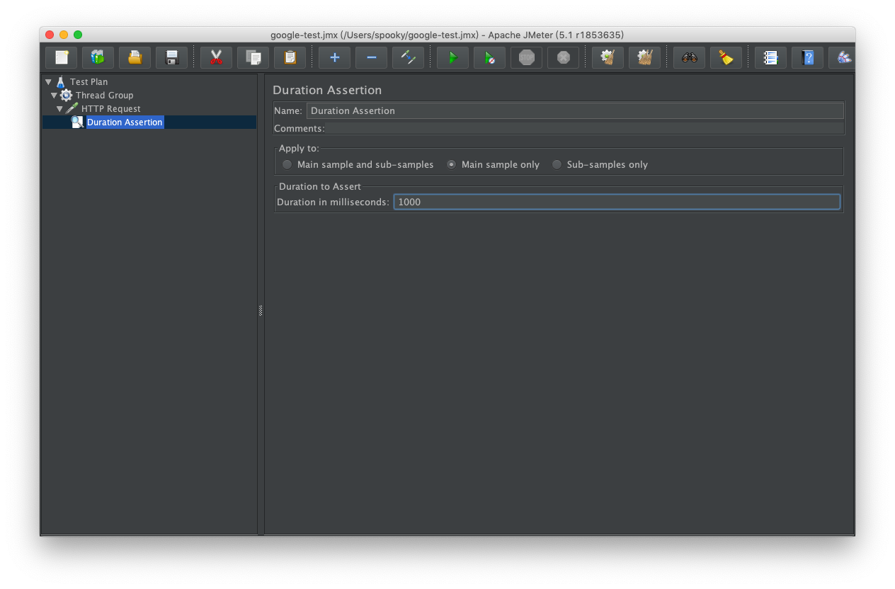
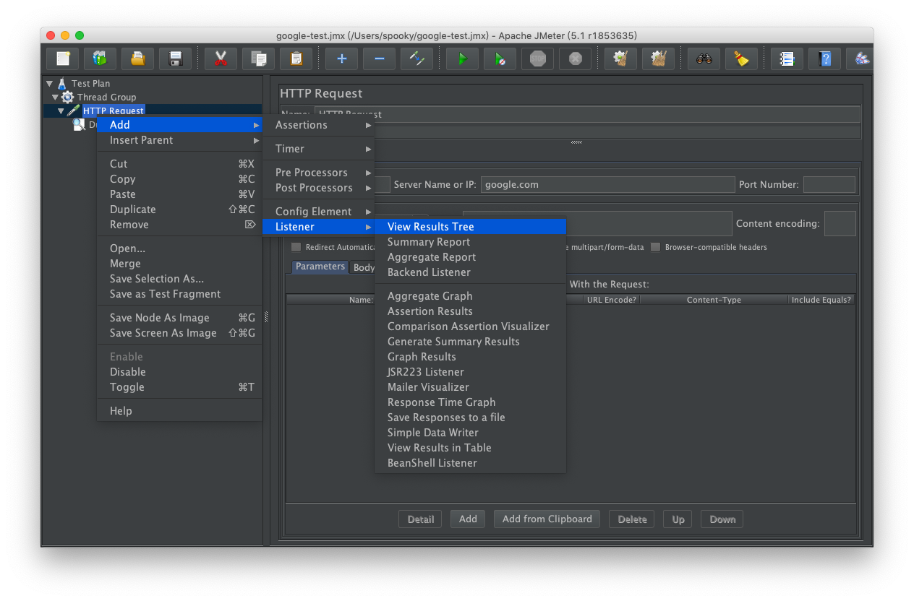
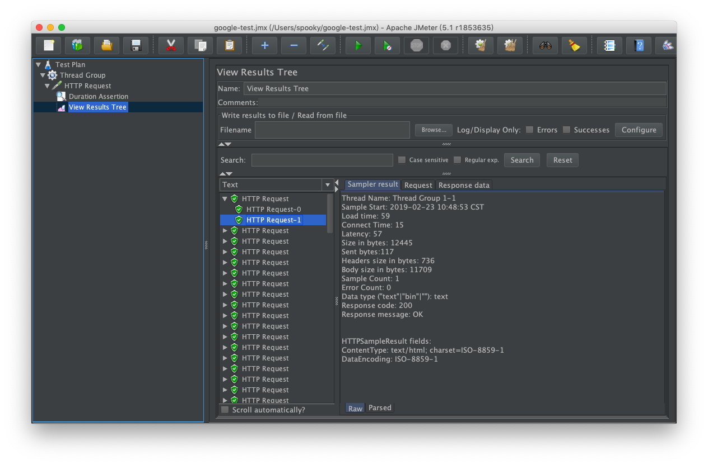
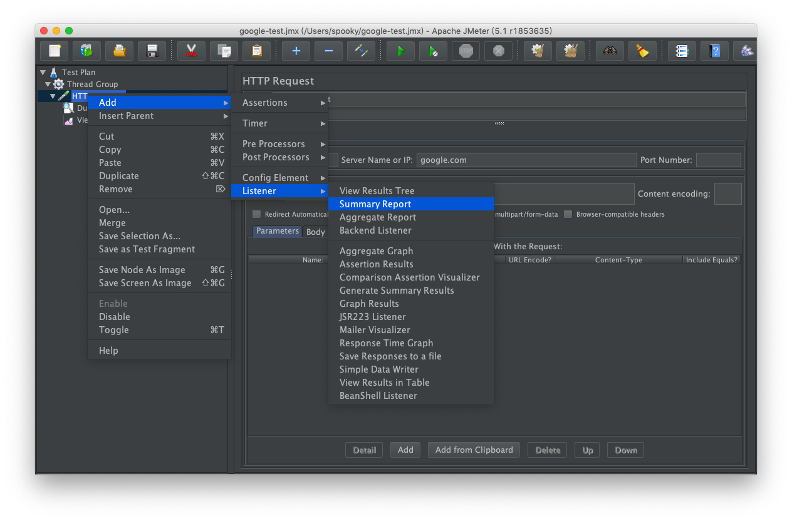
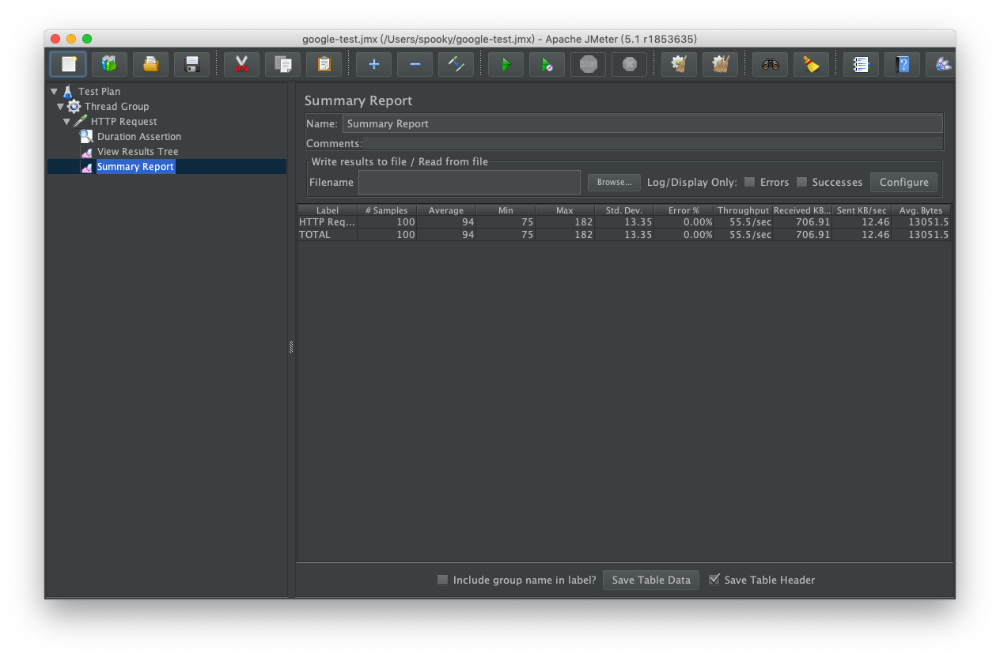

# jmeter 壓力測試工具使用，以 google.com 為例

JMeter是一套 Java-based、開源的測試工具，能對於您的網站進行功能與壓力測試。支援豐富的通訊協定、前(後)置處理、腳本撰寫、報表呈現與使用者變數功能，讓測試人員能夠撰寫符合產品測試的情境，達到有效的測試。

本章節將以網站測試作為範例介紹如何使用 jmeter 進行壓力測試。

## 下載與安裝

參考連結：http://dog0416.blogspot.com/2013/03/stress-test-jmeter-introduction.html#section1

## 使用 jmeter 測試 google 網站

### 開啟 jmeter 新增 Thread Group

輸入測試案例為 10 個 user，每一輪等待 1 秒，並且重復 10 次

### 新增 Sampler 為 HTTP Request

輸入測試網站為 google.com

### 新增 Duration Assertion

定義 每次 request 需要在 1000 毫秒內完成

### 新增 View Results Tree

點選執行

將可以看到每次執行的結果

### 新增 Summay Report

再次執行將可以看到相關壓力測試統計數字

## 參考資料

http://dog0416.blogspot.com/2013/03/stress-test-jmeter-introduction.html