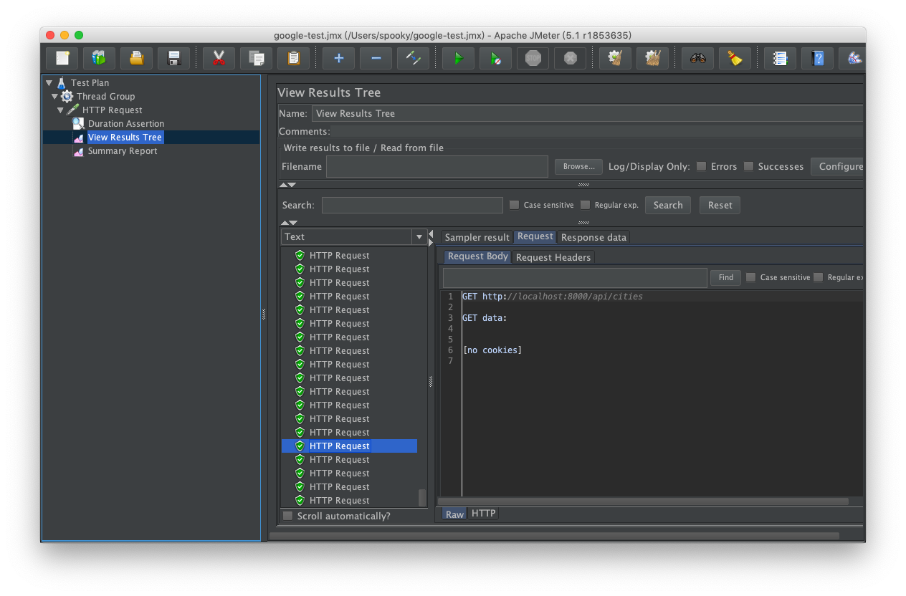
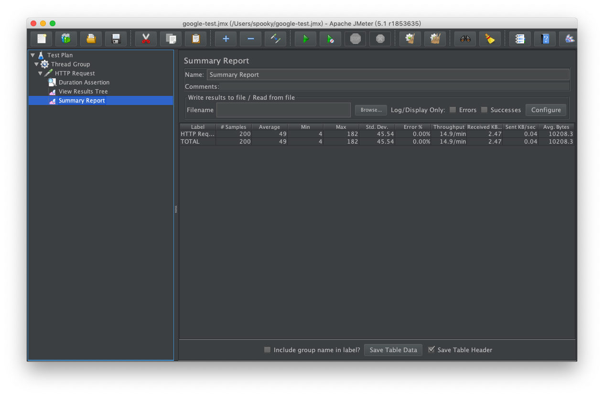
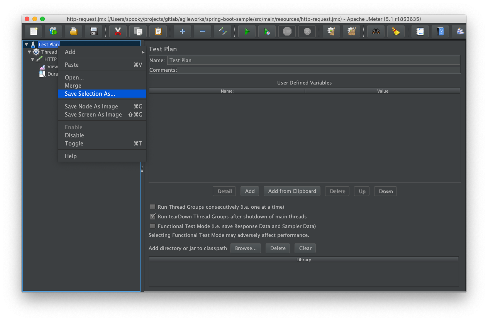
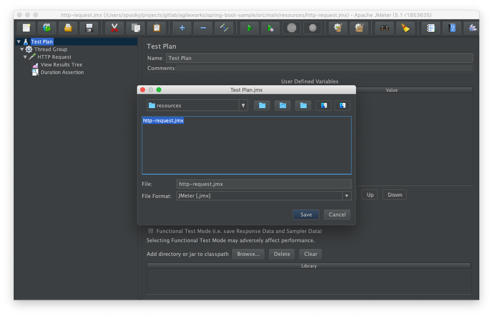
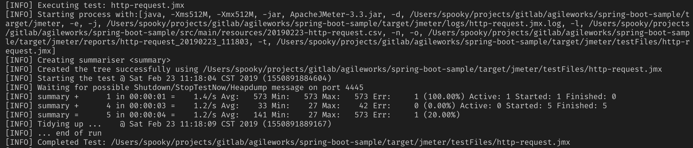
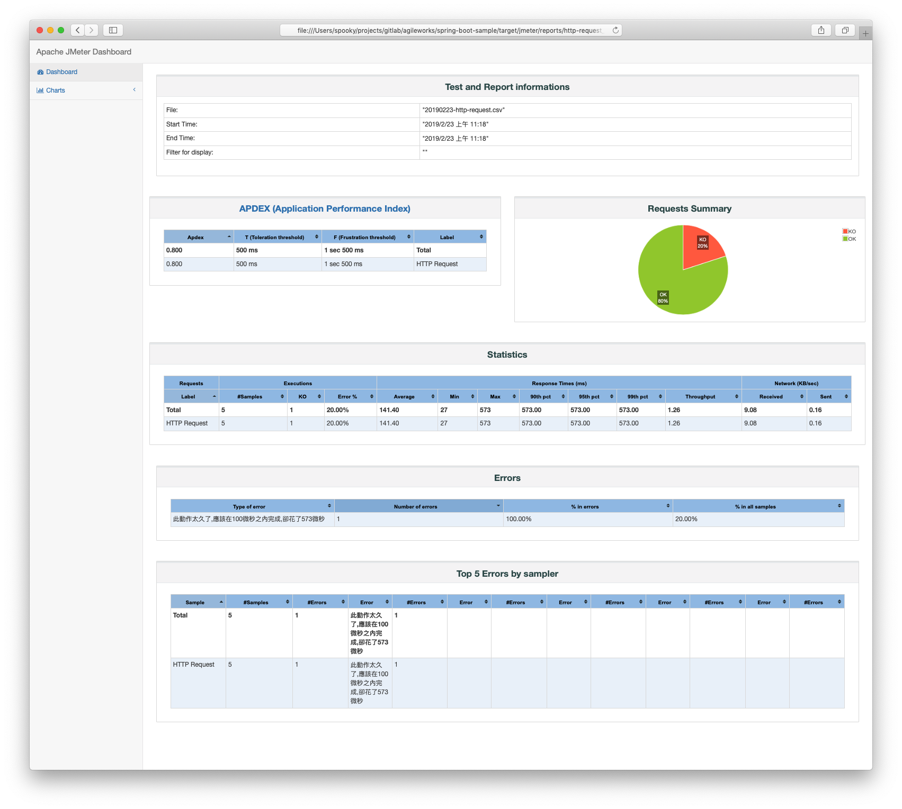
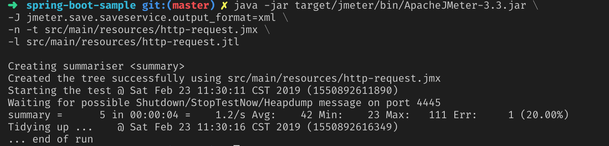

# java 專案使用 jmeter 進行測試

延續 [jmeter 壓力測試工具使用，以 google.com 為例](/jmeter/intro) 章節，此章節將以範例專案，介紹如何使用 jmeter 進行壓力測試


## 使用 jmeter 測試專案，透過 GUI 介面

### 啟動範例專案

git pull <https://gitlab.trunksys.com/agileworks/spring-boot-sample.git>

背景啟動 server: `nohup mvn spring-boot:run -Dserver.port=8000 &`

### 編輯測試網站網址

延續 [jmeter 壓力測試工具使用，以 google.com 為例](/jmeter/intro) 章節，調整 HTTP Request，進行下列調整：

1. 將網址改為 localhost
2. port 改為 8000
3. path 改為 `/api/cities`

執行測試，將會看到 View Results Tree 結果如下



及 Summary Report



透過 jmeter gui 設置好相關設定後，接著我們要進行的是讓專案可以透過指令完成 jmeter 壓力測試


## 使用 jmeter 測試專案，透過指令

使用指令運作壓力測試將有助於使用 Jenkins 進行自動化測試，此小節將說明如何透過指令運行

### 設置專案 pom.xml 引入 jmeter plugin

在 pom.xml 貼上下列設置

```
<plugin>
    <groupId>com.lazerycode.jmeter</groupId>
    <artifactId>jmeter-maven-plugin</artifactId>
    <version>2.6.0</version>
    <executions>
        <execution>
            <id>jmeter-tests</id>
            <goals>
                <goal>jmeter</goal>
            </goals>
        </execution>
    </executions>
    <configuration>
        <testFilesDirectory>${project.basedir}/src/main/resources</testFilesDirectory>
        <resultsDirectory>${project.basedir}/src/main/resources</resultsDirectory>
    </configuration>
</plugin>			
```
其中 `<testFilesDirectory>${project.basedir}/src/main/resources</testFilesDirectory>` 將是運行 jmeter 測試時讀取腳本檔案的路徑，我們可以把上一小節的設定結果另存到 `src/main/resources` 並且命名為 `http-request.jmx`





如此一來，我們可以透過下面指令進行測試

`mvn verify`

執行成功將會看到下面訊息輸出



我們可以開啟產出的報表檔案，路徑為 `target/jmeter/reports/http-request_${datetime}/index.html`，產出網頁畫面如下：



接著為了讓 Jenkins 能夠輸出測試報告，我們需要產出報表格式為 xml 形式。

## 使用 jmeter CLI Mode 輸出 xml report 格式

參考官方網站說明 CLI Mode 說明

<https://jmeter.apache.org/usermanual/get-started.html#non_gui>

當我們執行上一小節的 `mvn verify` 指令時，該指令會在專案底下路徑 `target/jmeter` 下載運行 jmeter 所需的所有檔案，我們在執行指令時會直接用裡面的相關程式，運行指令如下。

```
java -jar target/jmeter/bin/ApacheJMeter-3.3.jar \
-J jmeter.save.saveservice.output_format=xml \
-n -t src/main/resources/http-request.jmx \
-l src/main/resources/http-request.jtl
```

其中 -l 為輸出報表的位置，運行後可以看到下面輸出



則完成 xml 報表的輸出，下一章節將介紹如何使用 Jenkins 針對產出的 jtl 檔案輸出壓力測試報告。

