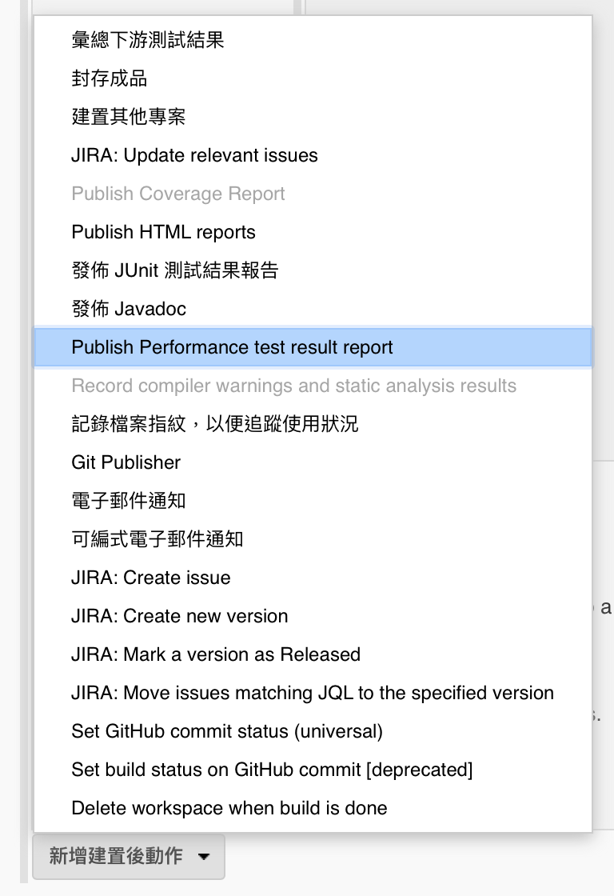
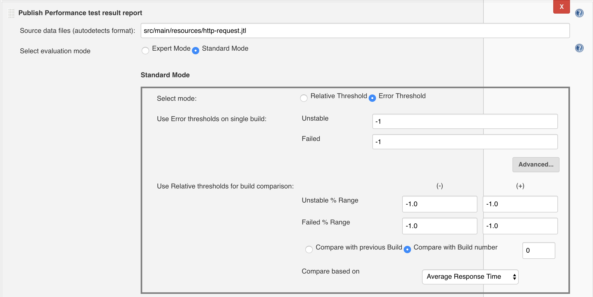
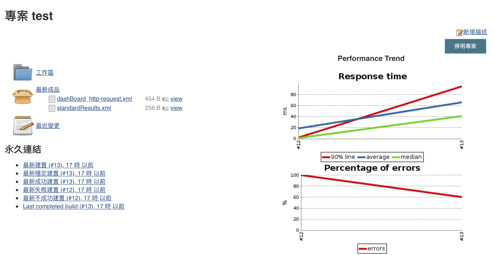
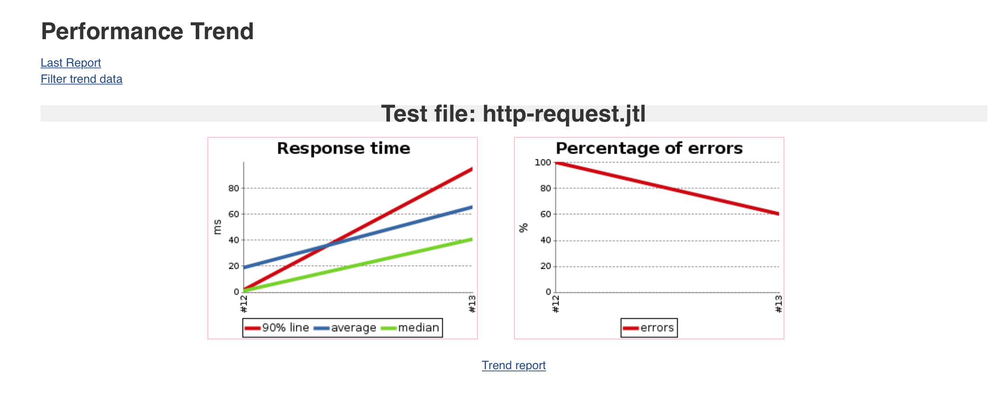

# java 專案搭配 Jenkins 使用 jmeter 進行測試

延續 [java 專案使用 jmeter 進行測試](/jmeter/with-java-proj) 章節，此章節說明如何將壓力測試執行，及報表產出透過 jenkins 進行設置。

## 設置 Jenkins 執行 Jmeter 測試案例，及產出報表

### 安裝 Performance Plugin

https://wiki.jenkins.io/display/JENKINS/Performance+Plugin


### 設置 bash shall 執行

```
nohup mvn spring-boot:run -Dserver.port=8000 &

while ! httping -qc1 http://localhost:8000/api/cities ; do sleep 1 ; done

java -jar target/jmeter/bin/ApacheJMeter-3.3.jar \
-J jmeter.save.saveservice.output_format=xml \
-n -t src/main/resources/http-request.jmx \
-l src/main/resources/http-request.jtl

pid=$(lsof -i:8000 -t); kill -TERM $pid || kill -KILL $pid
```

詳細說明如下：

#### 1. 背景執行專案

`nohup mvn spring-boot:run -Dserver.port=8000 &`

#### 2. 確認 server 已經完整運作，可以進行測試

`while ! httping -qc1 http://localhost:8000/api/cities ; do sleep 1 ; done`

#### 3. 運行 jmeter 進行壓力測試

```
java -jar target/jmeter/bin/ApacheJMeter-3.3.jar \
-J jmeter.save.saveservice.output_format=xml \
-n -t src/main/resources/http-request.jmx \
-l src/main/resources/http-request.jtl
```

#### 4. 測試完成，刪除 server 執行緒

`pid=$(lsof -i:8000 -t); kill -TERM $pid || kill -KILL $pid`

### 設置報表輸出

新增建置後動作加入 Performance Report



設置報表路徑 `src/main/resources/http-request.jtl`



執行 job 後，將可以看到報表產出，如下圖：



