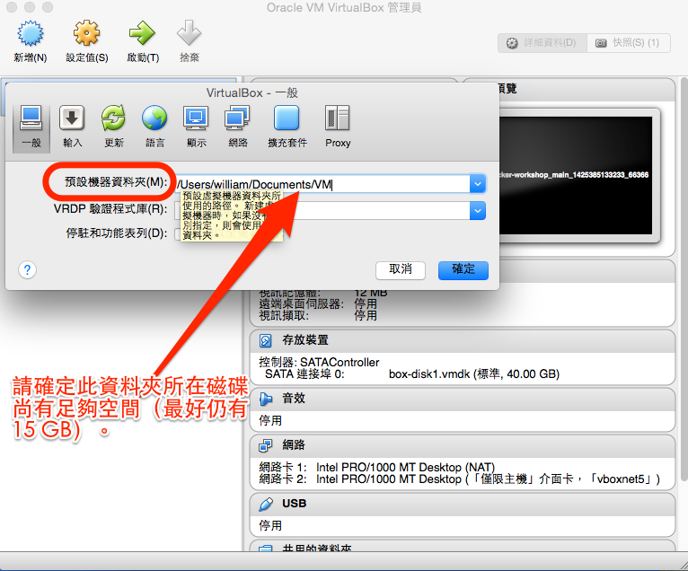

# 行前準備：申請帳號、安裝軟體

本課程含大量「實機操作」內容，需請您自備筆記型電腦。請先在您的電腦上，依照以下指示，完成行前準備：

1. 安裝軟體

2. 註冊 GitHub 帳號

3. 註冊 Docker Hub 帳號

4. [註冊並登入 AgileWorks 平台](config.md)

## 1\. 安裝軟體

本課程的「實機操作」部分，可以自備 **64 位元**的筆記型電腦。而這些筆電的作業系統，可能是 Windows，也可能是 Mac OS X，或各種 Linux distributions，或者使用上課教室的電腦，建議 VM 至少分配 2 GB 記憶體，Host 整體記憶體至少 4 GB。

為了讓課程有個一致的實作環境，減少操作上的環境變因，我們統一使用 [VirtualBox](https://www.virtualbox.org/) 虛擬機器組合，作為課堂實作的統一環境。

### 安裝步驟

為了順利進行工作坊的操作，請先依照以下步驟安裝 VirtualBox：

去 VirtualBox 官網的[下載頁](https://www.virtualbox.org/wiki/Downloads)，下載兩個安裝檔：

- VirtualBox platform packages
- VirtualBox Extension Pack

  並依序執行之。

  

### 磁碟空間

請確定 VirtualBox 之【預設機器資料夾】所在的磁碟上，仍有足夠空間，以容納各虛擬機內容及預載之 Docker 映像檔。

建議至少要預留 20 GB： 

## 2\. 註冊 GitHub 帳號

本課程會帶你實機操作，將欲「Docker 化」的程式碼置於 [GitHub](https://github.com/) 上，以供後續 Docker Hub 串接運用。

如果你還沒有 GitHub 帳號，請到[這裡](https://github.com/)註冊。

## 3\. 註冊 Docker Hub 帳號

本課程會帶你實機操作，如何利用 Docker 官方的 [Docker Hub](https://registry.hub.docker.com/) 服務，串接置於 GitHub 的程式碼，自動建置 Docker image。

如果你還沒有 Docker Hub 帳號，請到[這裡](https://hub.docker.com/account/signup/)註冊。
