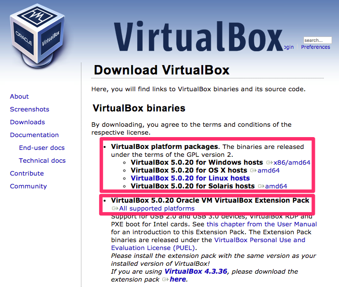

# 行前準備：申請帳號、安裝軟體

本課程含大量「實機操作」內容，需請您自備筆記型電腦。請先在您的電腦上，依照以下指示，完成行前準備：

1. 安裝軟體

2. 註冊 GitHub 帳號

3. 註冊 Docker Hub 帳號

4. [使用 AgileWorks 平台及下載上課用 VM 映像檔](AgileWorks.md)

## 1\. 安裝軟體

本課程的「實機操作」部分，可以自備 **64 位元**的筆記型電腦。而這些筆電的作業系統，可能是 Windows，也可能是 Mac OS X，或各種 Linux distributions，或者使用上課教室的電腦，VM 將需要分配 2 GB 記憶體，因此 Host 整體記憶體至少 4 GB。

為了讓課程有個一致的實作環境，減少操作上的環境變因，我們統一使用 [VirtualBox](https://www.virtualbox.org/) 虛擬機器組合，作為課堂實作的統一環境。

### 安裝步驟

為了順利進行工作坊的操作，請先依照以下步驟安裝 VirtualBox：

去 VirtualBox 官網的[下載頁](https://www.virtualbox.org/wiki/Downloads)，下載兩個安裝檔：

- VirtualBox platform packages
- VirtualBox Extension Pack

  並依序執行之。

  

VirtualBox 主程式下載安裝完成後，安裝擴充包之步驟可以參考[此網誌](http://www.arthurtoday.com/2011/01/oracle-vm-virtualbox-40-extension-pack_14.html)

### 磁碟空間

請確定 VirtualBox 之【預設機器資料夾】所在的磁碟上，仍有足夠空間，以容納各虛擬機內容及預載之 Docker 映像檔。

建議至少要預留 20 GB的空間給 VM 避免磁碟空間不足。

## 2\. 註冊 GitHub 帳號

本課程會帶你實機操作，課程中將會需要下載範例專案，以及進行 GitHub 與 Docker Hub 串接運用。

如果你還沒有 GitHub 帳號，請到 [github 官方網站](https://github.com/)進行註冊。

### 疑難排解

- [vt-x amd-v 異常造成 VM 無法開啟](docker/troubleshooting/vt_x_amd_v_error/README.md)

## 3\. 註冊 Docker Hub 帳號

如果你還沒有 Docker Hub 帳號，請到 [Docker Hub 網站](https://hub.docker.com/account/signup/) 進行註冊。
