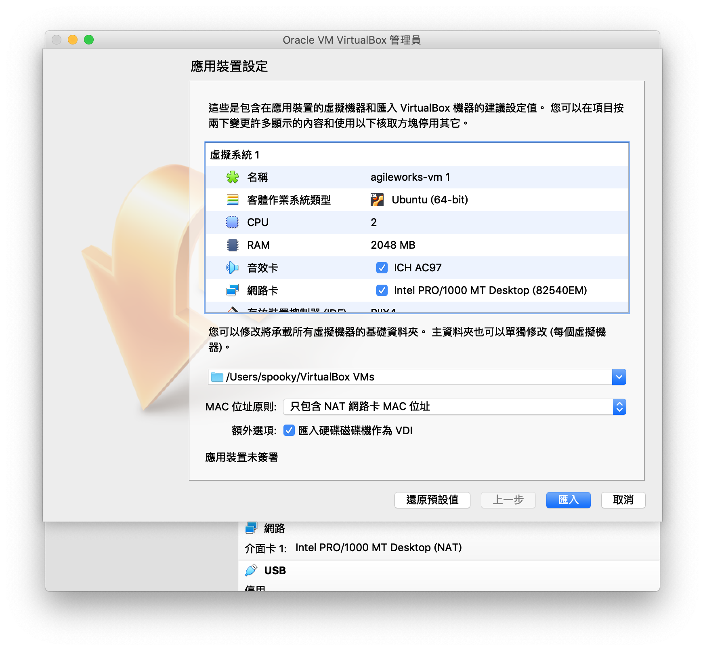
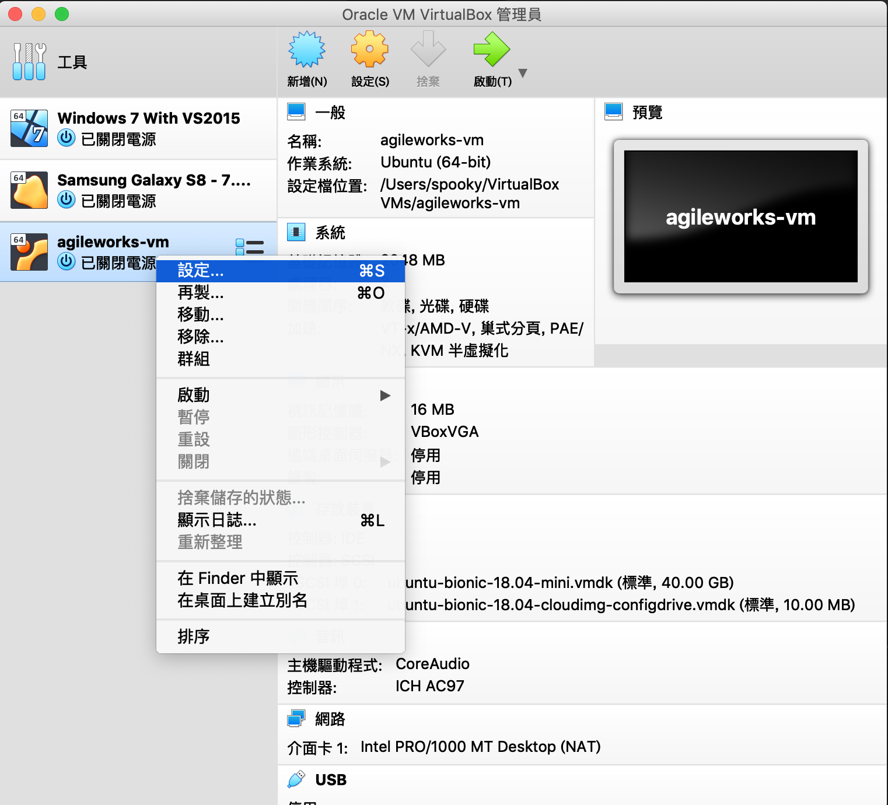
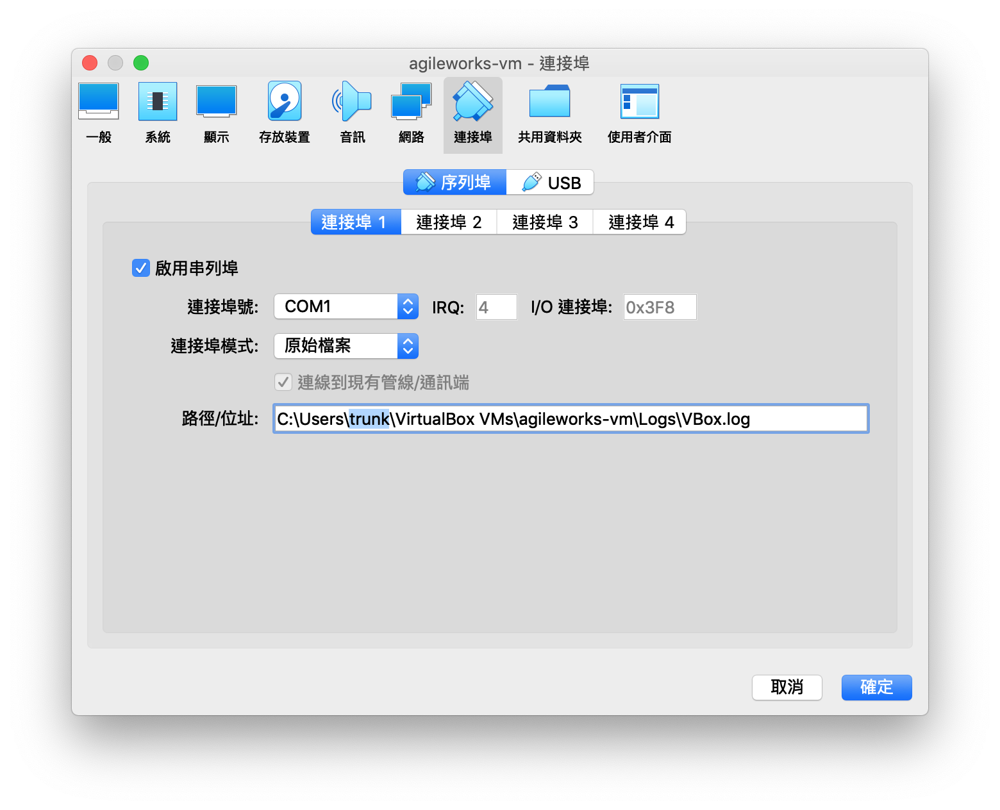
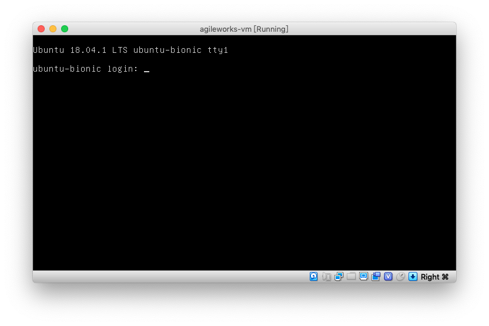

# VirtualBox 映像檔匯入

上課時將會收到 `agileworks-vm.ova` 檔案，雙擊兩下開啟匯入

匯入完成後，在 VM 上點選右鍵設定

進入`連接埠`

設置請依照畫面

其中`路徑/位置`會因為作業系統不同，如下：

* Windows: `C:\Users\${username}\VirtualBox VMs\agileworks-vm\Logs\VBox.log`

* Linux or MacOS: `/Users/${username}/VirtualBox VMs/agileworks-vm/Logs/VBox.log`

路徑中 `${username}` 請替換為目前登入作業系統的使用者名稱

設置完成後，啟動 VM，畫面停留在此畫面表示正常

