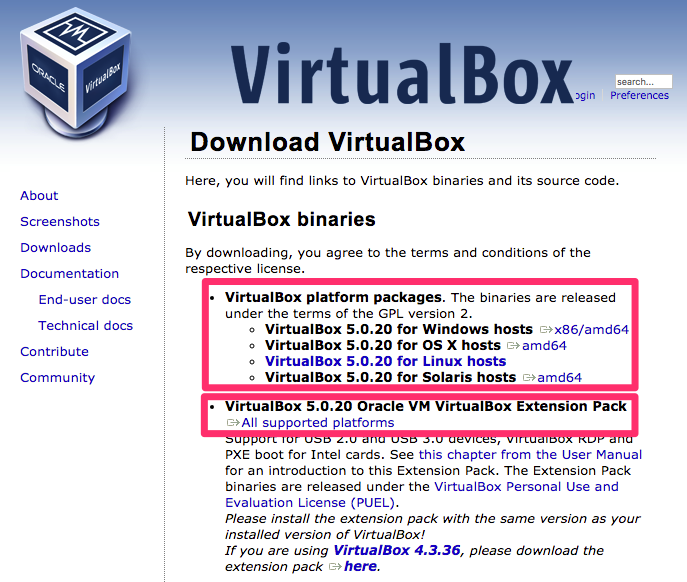

# 持續整合與自動化測試：自備筆電課前準備

本課程以實機操作實作練習為主，為維持課程品質及確保學習進度，我們假設您已經熟悉：

1. Linux 基本操作指令
2. Git 版本控制工具基本操作指令

請先完成以下軟體安裝：

1. Google Chrome 瀏覽器
2. VirtualBox 5.x 以上版本虛擬機器軟體及 Extension Pack

並確保電腦規格符合以下建議條件：

1. 建議使用 64 位元作業系統
2. 作業系統 Windows、Mac 或 Linux 皆可
3. 建議 8GB 以上實體記憶體（最低需求為 4GB）
4. 至少 40GB 磁碟可用空間
5. 建議搭配 SSD 硬碟才能順暢執行

我們在課程中會提供實作練習專用的 VM Image，以方便搭配教材內容。

<!--
4. [使用 AgileWorks 平台及下載上課用 VM 映像檔](AgileWorks.md)
-->

## 安裝 VirtualBox

依照您的作業系統類型，安裝 5.x 以上最新版本的 VirtualBox 軟體，建議同時安裝「VirtualBox Extension Pack」以支援虛擬機器的進階功能。

VirtualBox 下載頁面 https://www.virtualbox.org/wiki/Downloads

安裝 VirtualBox Extension Pack 之步驟可以參考[這份文件](http://www.arthurtoday.com/2011/01/oracle-vm-virtualbox-40-extension-pack_14.html)。

常見的 VirtualBox 安裝問題：

- [vt-x amd-v 異常造成 VM 無法開啟](docker/troubleshooting/vt_x_amd_v_error/README.md)

## 註冊 GitHub 帳號

本課程會帶你實機操作，課程中將會需要下載範例專案，以及進行 GitHub 與 Docker Hub 串接運用。

如果你還沒有 GitHub 帳號，請在 [GitHub 官方網站](https://github.com/)進行註冊。

## 註冊 Docker Hub 帳號

如果你還沒有 Docker Hub 帳號，請到 [Docker Hub 網站](https://hub.docker.com/account/signup/) 進行註冊。
