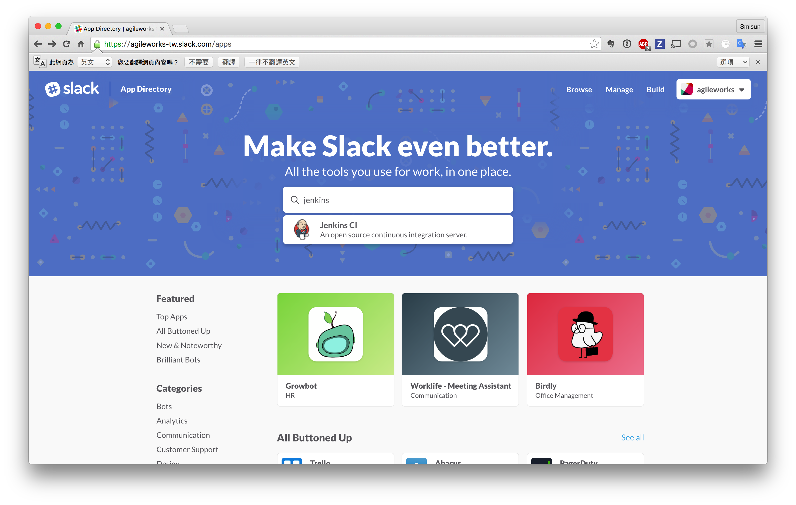
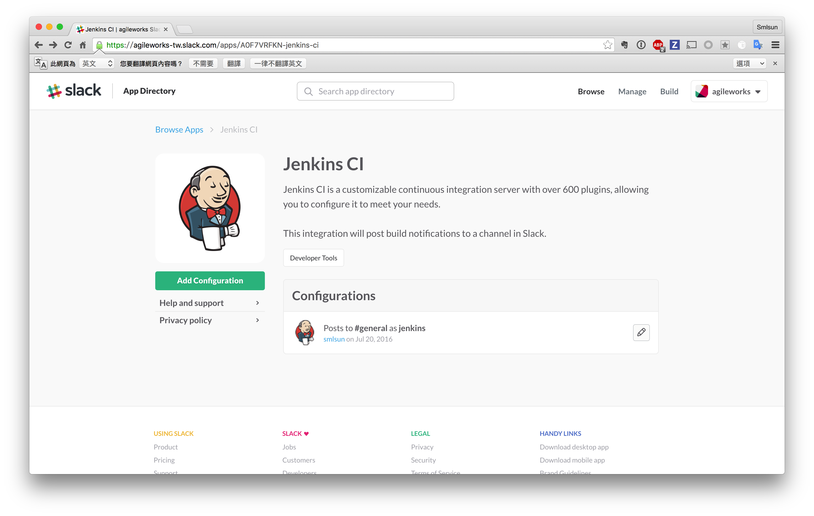
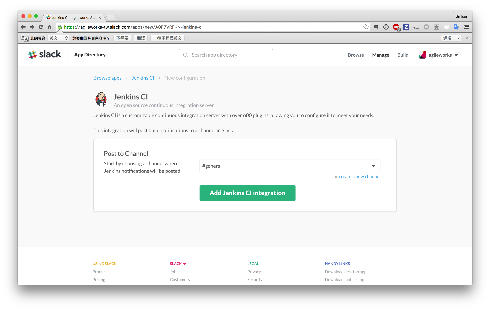
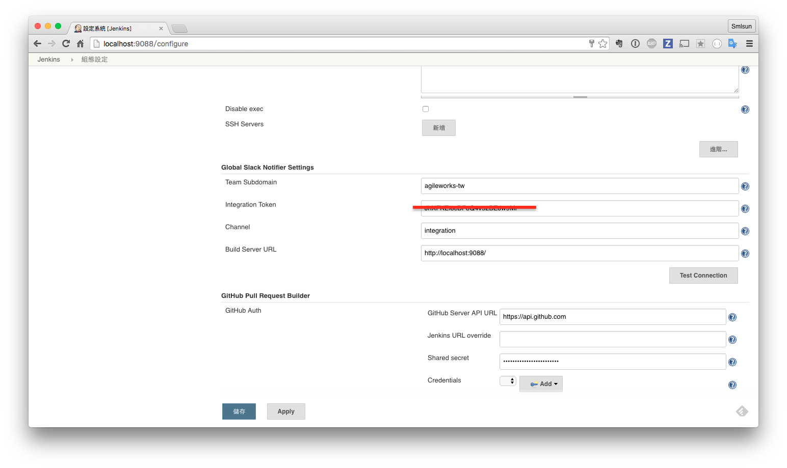
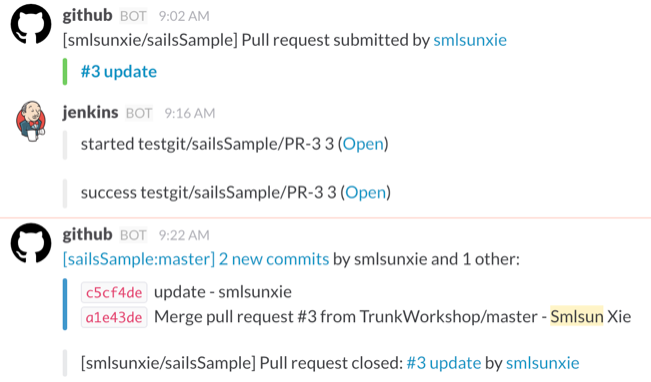

# Jenkins with Slack










注意：其中 `Build Server URL` 是必需要填入的，否則在執行 slack 訊息傳送時將查無 `env.BUILD_URL` 之環境變數。

## 使用 pipeline 進行 slack 操作

```
node {

  try {
    // start job alert.
    slackSend channel: '#general', message: "started ${env.JOB_NAME} ${env.BUILD_NUMBER} (<${env.BUILD_URL}|Open>)", teamDomain: 'trunk-agileworks', token: 'Jc01yjDQbEi6EKLNjk4Hq1Ap'

    // your script
    ...

    // job success alert.
    slackSend channel: '#general', color: 'good', message: "success ${env.JOB_NAME} ${env.BUILD_NUMBER} (<${env.BUILD_URL}|Open>)", teamDomain: 'trunk-agileworks', token: 'Jc01yjDQbEi6EKLNjk4Hq1Ap'
  }catch(e){

    // job fail alert.
    slackSend channel: '#general', color: 'danger', message: "fail ${env.JOB_NAME} ${env.BUILD_NUMBER} (<${env.BUILD_URL}|Open>)", teamDomain: 'trunk-agileworks', token: 'Jc01yjDQbEi6EKLNjk4Hq1Ap'
    throw e;
  }

}

```


## 結果呈現


