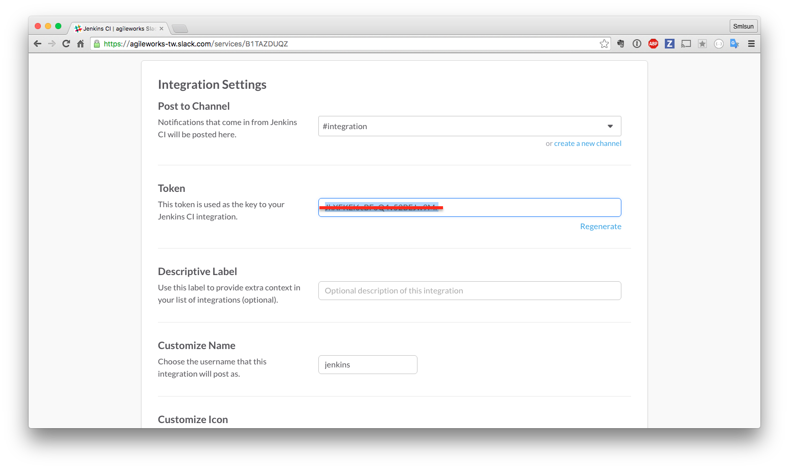

# Jenkins with Slack





注意：其中 `Build Server URL` 是必需要填入的，否則在執行 slack 訊息傳送時將查無 `env.BUILD_URL` 之環境變數。

## 使用 pipeline 進行 slack 操作

```
node {

  try {
    slackSend channel: '#general', message: "started ${env.JOB_NAME} ${env.BUILD_NUMBER} (<${env.BUILD_URL}|Open>)", teamDomain: 'trunk-agileworks', token: 'Jc01yjDQbEi6EKLNjk4Hq1Ap'

    stage 'checkout project'
    git url: 'https://github.com/TrunkWorkshop/sailsSample.git'

    stage 'check env'
    sh "node -v"

    stage 'install pm2'
    sh "npm install pm2 -g"

    stage 'build project'
    sh "npm install"

    stage 'test project'
    sh "npm run test-junit"
    step([$class: 'JUnitResultArchiver', testResults: 'test-results.xml'])

    stage 'run project'
    sh "npm run pm2-start"

    try{
      stage 'Approve, go production'
      def url = 'http://localhost:1337/'
      input message: "Does staging at $url look good? ", ok: "Deploy to production"
    }finally{
      sh "npm run pm2-stop"
    }

    stage 'package production'
    sh "make package-production"
    step([$class: 'ArtifactArchiver', artifacts: 'sailsSampleProd.tar.gz', fingerprint: true])

    stage 'deploy production'
    sh "make deploy-production-legacy"

    stage 'restart production'
    sh "make restart-production"

    slackSend channel: '#general', color: 'good', message: "success ${env.JOB_NAME} ${env.BUILD_NUMBER} (<${env.BUILD_URL}|Open>)", teamDomain: 'trunk-agileworks', token: 'Jc01yjDQbEi6EKLNjk4Hq1Ap'
  }catch(e){
    slackSend channel: '#general', color: 'danger', message: "fail ${env.JOB_NAME} ${env.BUILD_NUMBER} (<${env.BUILD_URL}|Open>)", teamDomain: 'trunk-agileworks', token: 'Jc01yjDQbEi6EKLNjk4Hq1Ap'
    throw e;
  }

}

```


## 結果呈現


